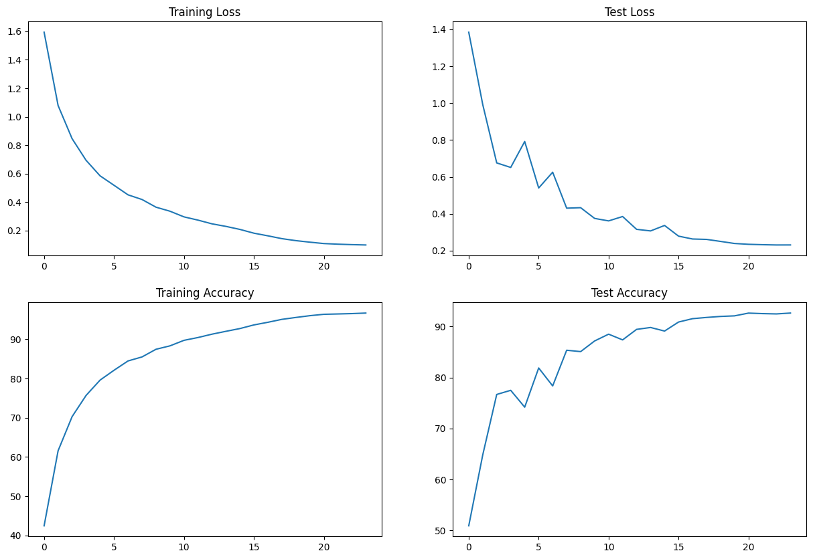

# Assignment #10 [ERA v2]

### Abstract
In this assignment we are going to train the CIFAR10 dataset to achieve 90% validation accuracy using RESNET Architecture in 24 epoch.
   * Need to use One Cycle Policy with no annihilation.
   * Need to use LR Finder to find LR_Max and LR_Min.
   * Need to use ADAM, and CrossEntropyLoss

### Summary
The model was able to acheive an accuracy of 92.63% using 6,573,130 params.

#### Model Summary
      ----------------------------------------------------------------
              Layer (type)               Output Shape         Param #
      ================================================================
                  Conv2d-1           [-1, 64, 32, 32]           1,728
             BatchNorm2d-2           [-1, 64, 32, 32]             128
                    ReLU-3           [-1, 64, 32, 32]               0
                 Dropout-4           [-1, 64, 32, 32]               0
                  Conv2d-5          [-1, 128, 32, 32]          73,728
               MaxPool2d-6          [-1, 128, 16, 16]               0
             BatchNorm2d-7          [-1, 128, 16, 16]             256
                    ReLU-8          [-1, 128, 16, 16]               0
                 Dropout-9          [-1, 128, 16, 16]               0
                 Conv2d-10          [-1, 128, 16, 16]         147,456
            BatchNorm2d-11          [-1, 128, 16, 16]             256
                   ReLU-12          [-1, 128, 16, 16]               0
                Dropout-13          [-1, 128, 16, 16]               0
                 Conv2d-14          [-1, 128, 16, 16]         147,456
            BatchNorm2d-15          [-1, 128, 16, 16]             256
                   ReLU-16          [-1, 128, 16, 16]               0
                Dropout-17          [-1, 128, 16, 16]               0
                 Conv2d-18          [-1, 256, 16, 16]         294,912
              MaxPool2d-19            [-1, 256, 8, 8]               0
            BatchNorm2d-20            [-1, 256, 8, 8]             512
                   ReLU-21            [-1, 256, 8, 8]               0
                Dropout-22            [-1, 256, 8, 8]               0
                 Conv2d-23            [-1, 512, 8, 8]       1,179,648
              MaxPool2d-24            [-1, 512, 4, 4]               0
            BatchNorm2d-25            [-1, 512, 4, 4]           1,024
                   ReLU-26            [-1, 512, 4, 4]               0
                Dropout-27            [-1, 512, 4, 4]               0
                 Conv2d-28            [-1, 512, 4, 4]       2,359,296
            BatchNorm2d-29            [-1, 512, 4, 4]           1,024
                   ReLU-30            [-1, 512, 4, 4]               0
                Dropout-31            [-1, 512, 4, 4]               0
                 Conv2d-32            [-1, 512, 4, 4]       2,359,296
            BatchNorm2d-33            [-1, 512, 4, 4]           1,024
                   ReLU-34            [-1, 512, 4, 4]               0
                Dropout-35            [-1, 512, 4, 4]               0
              MaxPool2d-36            [-1, 512, 1, 1]               0
                 Linear-37                   [-1, 10]           5,130
      ================================================================
      Total params: 6,573,130
      Trainable params: 6,573,130
      Non-trainable params: 0
      ----------------------------------------------------------------
      Input size (MB): 0.01
      Forward/backward pass size (MB): 8.00
      Params size (MB): 25.07
      Estimated Total Size (MB): 33.09
      ----------------------------------------------------------------

#### Training Status
      Epoch :  0
      Train: Loss=1.2450 Batch_id=97 Accuracy=42.48: 100%|██████████| 98/98 [00:25<00:00,  3.85it/s]
      Test set: Average loss: 1.3842, Accuracy: 5091/10000 (50.91%)

      Epoch :  1
      Train: Loss=0.9592 Batch_id=97 Accuracy=61.60: 100%|██████████| 98/98 [00:21<00:00,  4.53it/s]
      Test set: Average loss: 0.9922, Accuracy: 6481/10000 (64.81%)

      Epoch :  2
      Train: Loss=0.7282 Batch_id=97 Accuracy=70.28: 100%|██████████| 98/98 [00:20<00:00,  4.68it/s]
      Test set: Average loss: 0.6758, Accuracy: 7667/10000 (76.67%)

      Epoch :  3
      Train: Loss=0.6318 Batch_id=97 Accuracy=75.68: 100%|██████████| 98/98 [00:21<00:00,  4.51it/s]
      Test set: Average loss: 0.6512, Accuracy: 7748/10000 (77.48%)

      Epoch :  4
      Train: Loss=0.5322 Batch_id=97 Accuracy=79.59: 100%|██████████| 98/98 [00:21<00:00,  4.58it/s]
      Test set: Average loss: 0.7918, Accuracy: 7418/10000 (74.18%)

      Epoch :  5
      Train: Loss=0.4767 Batch_id=97 Accuracy=82.10: 100%|██████████| 98/98 [00:21<00:00,  4.66it/s]
      Test set: Average loss: 0.5399, Accuracy: 8186/10000 (81.86%)

      Epoch :  6
      Train: Loss=0.4466 Batch_id=97 Accuracy=84.47: 100%|██████████| 98/98 [00:20<00:00,  4.71it/s]
      Test set: Average loss: 0.6253, Accuracy: 7834/10000 (78.34%)

      Epoch :  7
      Train: Loss=0.3545 Batch_id=97 Accuracy=85.49: 100%|██████████| 98/98 [00:21<00:00,  4.60it/s]
      Test set: Average loss: 0.4305, Accuracy: 8534/10000 (85.34%)

      Epoch :  8
      Train: Loss=0.3660 Batch_id=97 Accuracy=87.44: 100%|██████████| 98/98 [00:21<00:00,  4.54it/s]
      Test set: Average loss: 0.4331, Accuracy: 8507/10000 (85.07%)

      Epoch :  9
      Train: Loss=0.3439 Batch_id=97 Accuracy=88.31: 100%|██████████| 98/98 [00:24<00:00,  3.98it/s]
      Test set: Average loss: 0.3749, Accuracy: 8716/10000 (87.16%)

      Epoch :  10
      Train: Loss=0.2337 Batch_id=97 Accuracy=89.72: 100%|██████████| 98/98 [00:21<00:00,  4.64it/s]
      Test set: Average loss: 0.3614, Accuracy: 8849/10000 (88.49%)

      Epoch :  11
      Train: Loss=0.2453 Batch_id=97 Accuracy=90.43: 100%|██████████| 98/98 [00:20<00:00,  4.69it/s]
      Test set: Average loss: 0.3851, Accuracy: 8737/10000 (87.37%)

      Epoch :  12
      Train: Loss=0.2272 Batch_id=97 Accuracy=91.29: 100%|██████████| 98/98 [00:20<00:00,  4.72it/s]
      Test set: Average loss: 0.3158, Accuracy: 8943/10000 (89.43%)

      Epoch :  13
      Train: Loss=0.2736 Batch_id=97 Accuracy=92.02: 100%|██████████| 98/98 [00:21<00:00,  4.64it/s]
      Test set: Average loss: 0.3071, Accuracy: 8980/10000 (89.80%)

      Epoch :  14
      Train: Loss=0.1896 Batch_id=97 Accuracy=92.72: 100%|██████████| 98/98 [00:21<00:00,  4.59it/s]
      Test set: Average loss: 0.3368, Accuracy: 8910/10000 (89.10%)

      Epoch :  15
      Train: Loss=0.1801 Batch_id=97 Accuracy=93.64: 100%|██████████| 98/98 [00:21<00:00,  4.66it/s]
      Test set: Average loss: 0.2788, Accuracy: 9087/10000 (90.87%)

      Epoch :  16
      Train: Loss=0.2318 Batch_id=97 Accuracy=94.32: 100%|██████████| 98/98 [00:20<00:00,  4.69it/s]
      Test set: Average loss: 0.2633, Accuracy: 9153/10000 (91.53%)

      Epoch :  17
      Train: Loss=0.1650 Batch_id=97 Accuracy=95.06: 100%|██████████| 98/98 [00:20<00:00,  4.71it/s]
      Test set: Average loss: 0.2612, Accuracy: 9177/10000 (91.77%)

      Epoch :  18
      Train: Loss=0.1219 Batch_id=97 Accuracy=95.55: 100%|██████████| 98/98 [00:20<00:00,  4.70it/s]
      Test set: Average loss: 0.2503, Accuracy: 9197/10000 (91.97%)

      Epoch :  19
      Train: Loss=0.1535 Batch_id=97 Accuracy=96.00: 100%|██████████| 98/98 [00:21<00:00,  4.52it/s]
      Test set: Average loss: 0.2391, Accuracy: 9208/10000 (92.08%)

      Epoch :  20
      Train: Loss=0.1101 Batch_id=97 Accuracy=96.35: 100%|██████████| 98/98 [00:21<00:00,  4.63it/s]
      Test set: Average loss: 0.2346, Accuracy: 9262/10000 (92.62%)

      Epoch :  21
      Train: Loss=0.1029 Batch_id=97 Accuracy=96.44: 100%|██████████| 98/98 [00:20<00:00,  4.68it/s]
      Test set: Average loss: 0.2324, Accuracy: 9252/10000 (92.52%)

      Epoch :  22
      Train: Loss=0.1228 Batch_id=97 Accuracy=96.53: 100%|██████████| 98/98 [00:20<00:00,  4.68it/s]
      Test set: Average loss: 0.2309, Accuracy: 9246/10000 (92.46%)

      Epoch :  23
      Train: Loss=0.0844 Batch_id=97 Accuracy=96.67: 100%|██████████| 98/98 [00:20<00:00,  4.72it/s]
      Test set: Average loss: 0.2311, Accuracy: 9263/10000 (92.63%)

### Analyze Training, Testing Loss and Accuracy
   