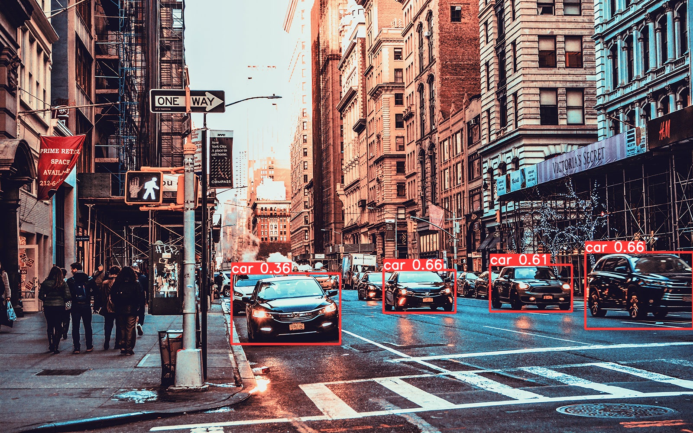
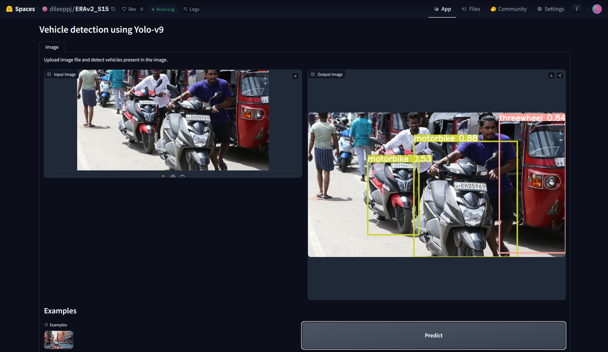
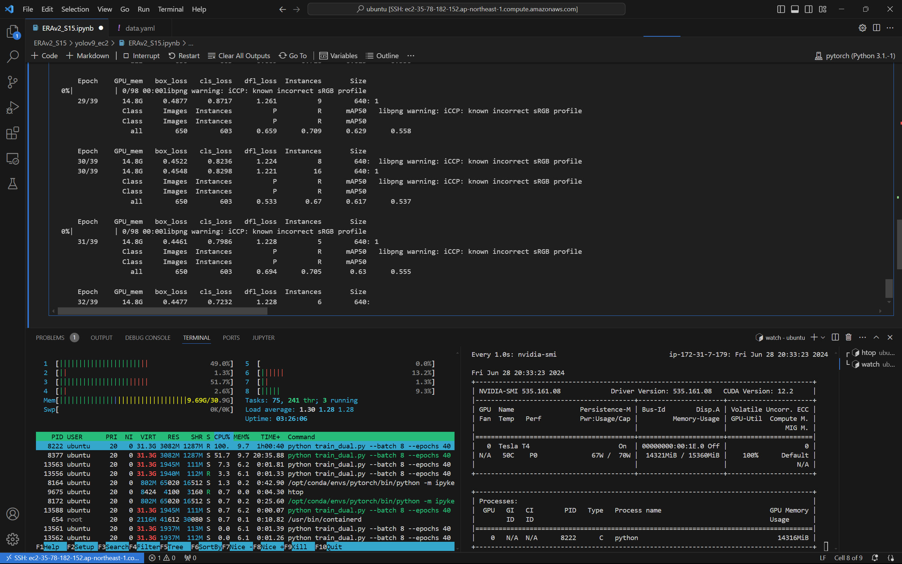
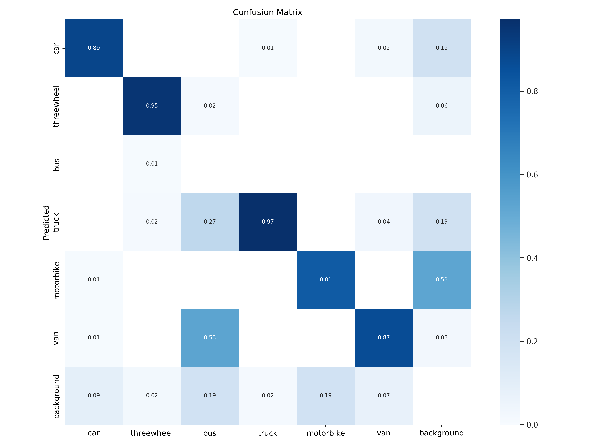
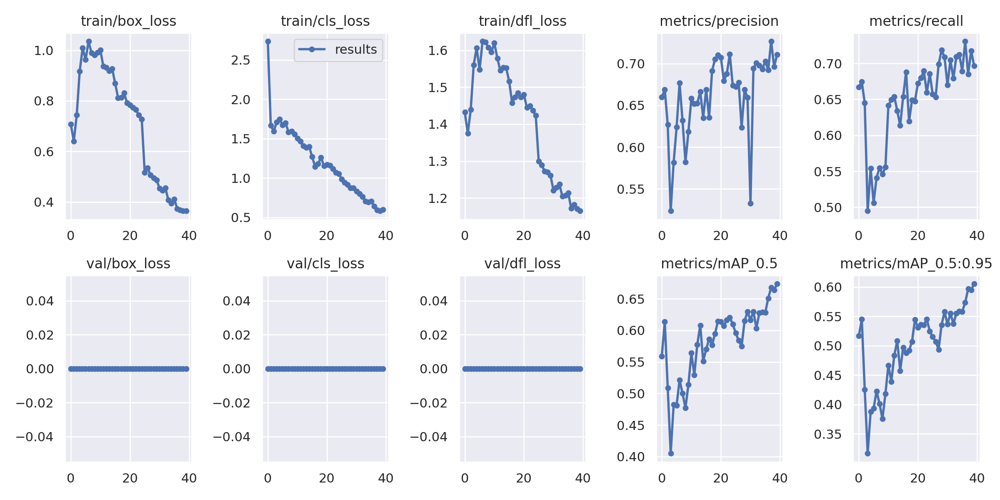

# YOLOv9 on Custom Dataset

Reference paper - [YOLOv9: Learning What You Want to Learn Using Programmable Gradient Information](https://arxiv.org/abs/2402.13616)

## Abstract

The Yolo v9 model is trained on a custom dataset comprising of 6 classes [car, threewheel, bus, truck, motorbike, van].

Demo ➡️ [Hugging Face Spaces App](https://huggingface.co/spaces/dileeppj/ERAv2_S15)

## Training Logs

 <b>Expand</b> 

        train_dual: weights=/home/ubuntu/ERAv2_S15/yolov9_ec2/weights/yolov9-e.pt, cfg=/home/ubuntu/ERAv2_S15/yolov9_ec2/yolov9/models/detect/yolov9-e.yaml, data=/home/ubuntu/ERAv2_S15/yolov9_ec2/customdata/data.yaml, hyp=hyp.scratch-high.yaml, epochs=40, batch_size=8, imgsz=640, rect=False, resume=False, nosave=False, noval=False, noautoanchor=False, noplots=False, evolve=None, bucket=, cache=None, image_weights=False, device=0, multi_scale=False, single_cls=False, optimizer=SGD, sync_bn=False, workers=8, project=runs/train, name=exp, exist_ok=False, quad=False, cos_lr=False, flat_cos_lr=False, fixed_lr=False, label_smoothing=0.0, patience=100, freeze=[0], save_period=-1, seed=0, local_rank=-1, min_items=0, close_mosaic=15, entity=None, upload_dataset=False, bbox_interval=-1, artifact_alias=latest
        YOLOv5 🚀 1e33dbb Python-3.10.14 torch-2.2.0 CUDA:0 (Tesla T4, 14931MiB)

        hyperparameters: lr0=0.01, lrf=0.01, momentum=0.937, weight_decay=0.0005, warmup_epochs=3.0, warmup_momentum=0.8, warmup_bias_lr=0.1, box=7.5, cls=0.5, cls_pw=1.0, dfl=1.5, obj_pw=1.0, iou_t=0.2, anchor_t=5.0, fl_gamma=0.0, hsv_h=0.015, hsv_s=0.7, hsv_v=0.4, degrees=0.0, translate=0.1, scale=0.9, shear=0.0, perspective=0.0, flipud=0.0, fliplr=0.5, mosaic=1.0, mixup=0.15, copy_paste=0.3
        ClearML: run 'pip install clearml' to automatically track, visualize and remotely train YOLO 🚀 in ClearML
        Comet: run 'pip install comet_ml' to automatically track and visualize YOLO 🚀 runs in Comet
        TensorBoard: Start with 'tensorboard --logdir runs/train', view at http://localhost:6006/
        Overriding model.yaml nc=80 with nc=6

                        from  n    params  module                                  arguments                     
        0                -1  1         0  models.common.Silence                   []                            
        1                -1  1      1856  models.common.Conv                      [3, 64, 3, 2]                 
        2                -1  1     73984  models.common.Conv                      [64, 128, 3, 2]               
        3                -1  1    252160  models.common.RepNCSPELAN4              [128, 256, 128, 64, 2]        
        4                -1  1    164352  models.common.ADown                     [256, 256]                    
        5                -1  1   1004032  models.common.RepNCSPELAN4              [256, 512, 256, 128, 2]       
        6                -1  1    656384  models.common.ADown                     [512, 512]                    
        7                -1  1   4006912  models.common.RepNCSPELAN4              [512, 1024, 512, 256, 2]      
        8                -1  1   2623488  models.common.ADown                     [1024, 1024]                  
        9                -1  1   4269056  models.common.RepNCSPELAN4              [1024, 1024, 512, 256, 2]     
        10                 1  1      4160  models.common.CBLinear                  [64, [64]]                    
        11                 3  1     49344  models.common.CBLinear                  [256, [64, 128]]              
        12                 5  1    229824  models.common.CBLinear                  [512, [64, 128, 256]]         
        13                 7  1    984000  models.common.CBLinear                  [1024, [64, 128, 256, 512]]   
        14                 9  1   2033600  models.common.CBLinear                  [1024, [64, 128, 256, 512, 1024]]
        15                 0  1      1856  models.common.Conv                      [3, 64, 3, 2]                 
        16[10, 11, 12, 13, 14, -1]  1         0  models.common.CBFuse                    [[0, 0, 0, 0, 0]]             
        17                -1  1     73984  models.common.Conv                      [64, 128, 3, 2]               
        18[11, 12, 13, 14, -1]  1         0  models.common.CBFuse                    [[1, 1, 1, 1]]                
        19                -1  1    252160  models.common.RepNCSPELAN4              [128, 256, 128, 64, 2]        
        20                -1  1    164352  models.common.ADown                     [256, 256]                    
        21  [12, 13, 14, -1]  1         0  models.common.CBFuse                    [[2, 2, 2]]                   
        22                -1  1   1004032  models.common.RepNCSPELAN4              [256, 512, 256, 128, 2]       
        23                -1  1    656384  models.common.ADown                     [512, 512]                    
        24      [13, 14, -1]  1         0  models.common.CBFuse                    [[3, 3]]                      
        25                -1  1   4006912  models.common.RepNCSPELAN4              [512, 1024, 512, 256, 2]      
        26                -1  1   2623488  models.common.ADown                     [1024, 1024]                  
        27          [14, -1]  1         0  models.common.CBFuse                    [[4]]                         
        28                -1  1   4269056  models.common.RepNCSPELAN4              [1024, 1024, 512, 256, 2]     
        29                 9  1    787968  models.common.SPPELAN                   [1024, 512, 256]              
        30                -1  1         0  torch.nn.modules.upsampling.Upsample    [None, 2, 'nearest']          
        31           [-1, 7]  1         0  models.common.Concat                    [1]                           
        32                -1  1   4005888  models.common.RepNCSPELAN4              [1536, 512, 512, 256, 2]      
        33                -1  1         0  torch.nn.modules.upsampling.Upsample    [None, 2, 'nearest']          
        34           [-1, 5]  1         0  models.common.Concat                    [1]                           
        35                -1  1   1069056  models.common.RepNCSPELAN4              [1024, 256, 256, 128, 2]      
        36                28  1    787968  models.common.SPPELAN                   [1024, 512, 256]              
        37                -1  1         0  torch.nn.modules.upsampling.Upsample    [None, 2, 'nearest']          
        38          [-1, 25]  1         0  models.common.Concat                    [1]                           
        39                -1  1   4005888  models.common.RepNCSPELAN4              [1536, 512, 512, 256, 2]      
        40                -1  1         0  torch.nn.modules.upsampling.Upsample    [None, 2, 'nearest']          
        41          [-1, 22]  1         0  models.common.Concat                    [1]                           
        42                -1  1   1069056  models.common.RepNCSPELAN4              [1024, 256, 256, 128, 2]      
        43                -1  1    164352  models.common.ADown                     [256, 256]                    
        44          [-1, 39]  1         0  models.common.Concat                    [1]                           
        45                -1  1   3612672  models.common.RepNCSPELAN4              [768, 512, 512, 256, 2]       
        46                -1  1    656384  models.common.ADown                     [512, 512]                    
        47          [-1, 36]  1         0  models.common.Concat                    [1]                           
        48                -1  1  12860416  models.common.RepNCSPELAN4              [1024, 512, 1024, 512, 2]     
        49[35, 32, 29, 42, 45, 48]  1  10990532  models.yolo.DualDDetect                 [6, [256, 512, 512, 256, 512, 512]]
        yolov9-e summary: 1475 layers, 69415556 parameters, 69415524 gradients, 244.9 GFLOPs

        Transferred 2160/2172 items from /home/ubuntu/ERAv2_S15/yolov9_ec2/weights/yolov9-e.pt
        AMP: checks passed ✅
        optimizer: SGD(lr=0.01) with parameter groups 356 weight(decay=0.0), 375 weight(decay=0.0005), 373 bias
        albumentations: Blur(p=0.01, blur_limit=(3, 7)), MedianBlur(p=0.01, blur_limit=(3, 7)), ToGray(p=0.01), CLAHE(p=0.01, clip_limit=(1, 4.0), tile_grid_size=(8, 8))
        train: Scanning /home/ubuntu/ERAv2_S15/yolov9_ec2/customdata/train/labels.cache.
        val: Scanning /home/ubuntu/ERAv2_S15/yolov9_ec2/customdata/valid/labels.cache...
        Plotting labels to runs/train/exp5/labels.jpg... 
        Image sizes 640 train, 640 val
        Using 8 dataloader workers
        Logging results to runs/train/exp5
        Starting training for 40 epochs...

            Epoch    GPU_mem   box_loss   cls_loss   dfl_loss  Instances       Size
        0%|          | 0/98 00:00libpng warning: iCCP: known incorrect sRGB profile
        libpng warning: iCCP: known incorrect sRGB profile
            0/39      12.2G      1.444      5.042      2.246         18        640:  Exception in thread Thread-5 (plot_images):
        Traceback (most recent call last):
        File "/opt/conda/envs/pytorch/lib/python3.10/threading.py", line 1016, in _bootstrap_inner
            self.run()
        File "/opt/conda/envs/pytorch/lib/python3.10/threading.py", line 953, in run
            self._target(*self._args, **self._kwargs)
        File "/home/ubuntu/ERAv2_S15/yolov9_ec2/yolov9/utils/plots.py", line 300, in plot_images
            annotator.box_label(box, label, color=color)
        File "/home/ubuntu/ERAv2_S15/yolov9_ec2/yolov9/utils/plots.py", line 86, in box_label
            w, h = self.font.getsize(label)  # text width, height
        AttributeError: 'FreeTypeFont' object has no attribute 'getsize'
        WARNING ⚠️ TensorBoard graph visualization failure Only tensors, lists, tuples of tensors, or dictionary of tensors can be output from traced functions
            0/39      12.9G      1.075      4.953      1.747         26        640:  Exception in thread Thread-6 (plot_images):
        Traceback (most recent call last):
        File "/opt/conda/envs/pytorch/lib/python3.10/threading.py", line 1016, in _bootstrap_inner
            self.run()
        File "/opt/conda/envs/pytorch/lib/python3.10/threading.py", line 953, in run
            self._target(*self._args, **self._kwargs)
        File "/home/ubuntu/ERAv2_S15/yolov9_ec2/yolov9/utils/plots.py", line 300, in plot_images
            annotator.box_label(box, label, color=color)
        File "/home/ubuntu/ERAv2_S15/yolov9_ec2/yolov9/utils/plots.py", line 86, in box_label
            w, h = self.font.getsize(label)  # text width, height
        AttributeError: 'FreeTypeFont' object has no attribute 'getsize'
            0/39      12.9G      1.046      4.925      1.705         24        640:  Exception in thread Thread-7 (plot_images):
        Traceback (most recent call last):
        File "/opt/conda/envs/pytorch/lib/python3.10/threading.py", line 1016, in _bootstrap_inner
            self.run()
        File "/opt/conda/envs/pytorch/lib/python3.10/threading.py", line 953, in run
            self._target(*self._args, **self._kwargs)
        File "/home/ubuntu/ERAv2_S15/yolov9_ec2/yolov9/utils/plots.py", line 300, in plot_images
            annotator.box_label(box, label, color=color)
        File "/home/ubuntu/ERAv2_S15/yolov9_ec2/yolov9/utils/plots.py", line 86, in box_label
            w, h = self.font.getsize(label)  # text width, height
        AttributeError: 'FreeTypeFont' object has no attribute 'getsize'
            0/39      12.9G     0.8985      4.687      1.559         19        640:  libpng warning: iCCP: known incorrect sRGB profile
            0/39      12.9G      0.907       4.62      1.586         20        640:  libpng warning: iCCP: known incorrect sRGB profile
            0/39      13.6G      0.837      3.578      1.522         20        640:  libpng warning: iCCP: known incorrect sRGB profile
            0/39      13.6G     0.7717      3.242      1.469         20        640:  libpng warning: iCCP: known incorrect sRGB profile
            0/39      13.6G     0.7321       2.91      1.448         18        640:  libpng warning: iCCP: known incorrect sRGB profile
            0/39      13.6G     0.7079      2.738      1.432         15        640: 1
                        Class     Images  Instances          P          R      mAP50   libpng warning: iCCP: known incorrect sRGB profile
                        Class     Images  Instances          P          R      mAP50   
                        all        650        603       0.66      0.667      0.559      0.517

            Epoch    GPU_mem   box_loss   cls_loss   dfl_loss  Instances       Size
        0%|          | 0/98 00:00libpng warning: iCCP: known incorrect sRGB profile
            1/39      12.9G     0.6357      1.756      1.382         21        640:  libpng warning: iCCP: known incorrect sRGB profile
            1/39      12.9G     0.6315       1.73      1.374         32        640:  libpng warning: iCCP: known incorrect sRGB profile
        libpng warning: iCCP: known incorrect sRGB profile
            1/39      12.9G     0.6447      1.714      1.382         24        640:  libpng warning: iCCP: known incorrect sRGB profile
            1/39      12.9G     0.6468      1.679      1.379         26        640:  libpng warning: iCCP: known incorrect sRGB profile
            1/39      12.9G     0.6394      1.666      1.375         10        640: 1
                        Class     Images  Instances          P          R      mAP50   libpng warning: iCCP: known incorrect sRGB profile
                        Class     Images  Instances          P          R      mAP50   
                        all        650        603      0.669      0.675      0.614      0.545

            Epoch    GPU_mem   box_loss   cls_loss   dfl_loss  Instances       Size
        0%|          | 0/98 00:00libpng warning: iCCP: known incorrect sRGB profile
            2/39      12.9G     0.7225      1.394       1.41         45        640:  libpng warning: iCCP: known incorrect sRGB profile
            2/39      12.9G     0.6999      1.539      1.395         36        640:  libpng warning: iCCP: known incorrect sRGB profile
            2/39      12.9G     0.7287      1.587      1.426         20        640:  libpng warning: iCCP: known incorrect sRGB profile
            2/39      12.9G     0.7439      1.595      1.439         17        640: 1
                        Class     Images  Instances          P          R      mAP50   libpng warning: iCCP: known incorrect sRGB profile
                        Class     Images  Instances          P          R      mAP50   
                        all        650        603      0.627      0.645      0.509      0.426

            Epoch    GPU_mem   box_loss   cls_loss   dfl_loss  Instances       Size
            3/39      12.9G     0.7659      1.563      1.445         20        640:  libpng warning: iCCP: known incorrect sRGB profile
            3/39      12.9G     0.8091      1.567       1.47         25        640:  libpng warning: iCCP: known incorrect sRGB profile
            3/39      12.9G     0.8355      1.606      1.491         31        640:  libpng warning: iCCP: known incorrect sRGB profile
            3/39      12.9G     0.8595      1.626      1.506         20        640:  libpng warning: iCCP: known incorrect sRGB profile
            3/39      12.9G     0.8876      1.675      1.524         21        640:  libpng warning: iCCP: known incorrect sRGB profile
            3/39      12.9G     0.8985      1.671      1.536         24        640:  libpng warning: iCCP: known incorrect sRGB profile
            3/39      12.9G     0.9166      1.708       1.56         16        640: 1
                        Class     Images  Instances          P          R      mAP50   libpng warning: iCCP: known incorrect sRGB profile
                        Class     Images  Instances          P          R      mAP50   
                        all        650        603      0.524      0.495      0.405      0.317

            Epoch    GPU_mem   box_loss   cls_loss   dfl_loss  Instances       Size
        0%|          | 0/98 00:00libpng warning: iCCP: known incorrect sRGB profile
            4/39        12G     0.9514      1.811       1.59         43        640:  libpng warning: iCCP: known incorrect sRGB profile
            4/39        12G       1.01      1.779       1.62         25        640:  libpng warning: iCCP: known incorrect sRGB profile
            4/39        12G      1.009      1.747      1.606         23        640: 1
                        Class     Images  Instances          P          R      mAP50   libpng warning: iCCP: known incorrect sRGB profile
                        Class     Images  Instances          P          R      mAP50   
                        all        650        603      0.582      0.554      0.482      0.388

            Epoch    GPU_mem   box_loss   cls_loss   dfl_loss  Instances       Size
        0%|          | 0/98 00:00libpng warning: iCCP: known incorrect sRGB profile
            5/39      11.9G     0.9909       1.73      1.557         29        640:  libpng warning: iCCP: known incorrect sRGB profile
            5/39      11.9G     0.9615      1.689      1.537         17        640:  libpng warning: iCCP: known incorrect sRGB profile
        libpng warning: iCCP: known incorrect sRGB profile
            5/39      11.9G     0.9623      1.674      1.548         13        640: 1
                        Class     Images  Instances          P          R      mAP50   libpng warning: iCCP: known incorrect sRGB profile
                        Class     Images  Instances          P          R      mAP50   
                        all        650        603      0.624      0.506      0.481      0.393

            Epoch    GPU_mem   box_loss   cls_loss   dfl_loss  Instances       Size
            6/39      11.9G      1.246      1.929      1.818         35        640:  libpng warning: iCCP: known incorrect sRGB profile
            6/39      11.9G       1.05      1.716      1.653         26        640:  libpng warning: iCCP: known incorrect sRGB profile
            6/39      11.9G      1.039      1.688       1.63         29        640:  libpng warning: iCCP: known incorrect sRGB profile
            6/39      11.9G      1.035      1.701      1.624         32        640: 1
                        Class     Images  Instances          P          R      mAP50   libpng warning: iCCP: known incorrect sRGB profile
                        Class     Images  Instances          P          R      mAP50   
                        all        650        603      0.677      0.541      0.522      0.423

            Epoch    GPU_mem   box_loss   cls_loss   dfl_loss  Instances       Size
            7/39      11.9G     0.9098       1.51      1.453         32        640:  libpng warning: iCCP: known incorrect sRGB profile
            7/39      11.9G      1.023      1.628      1.643         19        640:  libpng warning: iCCP: known incorrect sRGB profile
            7/39      11.9G      1.007      1.612      1.629         21        640:  libpng warning: iCCP: known incorrect sRGB profile
            7/39      11.9G     0.9965      1.591      1.627         21        640:  libpng warning: iCCP: known incorrect sRGB profile
            7/39      11.9G      0.989      1.585      1.622         27        640: 1
                        Class     Images  Instances          P          R      mAP50   libpng warning: iCCP: known incorrect sRGB profile
                        Class     Images  Instances          P          R      mAP50   
                        all        650        603      0.632      0.555        0.5      0.402

            Epoch    GPU_mem   box_loss   cls_loss   dfl_loss  Instances       Size
        0%|          | 0/98 00:00libpng warning: iCCP: known incorrect sRGB profile
            8/39      14.8G     0.9838      1.537      1.605         16        640:  libpng warning: iCCP: known incorrect sRGB profile
            8/39      14.8G     0.9655      1.593      1.595         26        640:  libpng warning: iCCP: known incorrect sRGB profile
            8/39      14.8G     0.9889      1.617      1.622         20        640:  libpng warning: iCCP: known incorrect sRGB profile
            8/39      14.8G     0.9706      1.591      1.614         26        640:  libpng warning: iCCP: known incorrect sRGB profile
            8/39      14.8G     0.9766      1.599       1.62         21        640:  libpng warning: iCCP: known incorrect sRGB profile
            8/39      14.8G     0.9763      1.597       1.62         24        640:  libpng warning: iCCP: known incorrect sRGB profile
            8/39      14.8G     0.9808      1.596      1.607         23        640: 1
                        Class     Images  Instances          P          R      mAP50   libpng warning: iCCP: known incorrect sRGB profile
                        Class     Images  Instances          P          R      mAP50   
                        all        650        603      0.582      0.546      0.477      0.375
        libpng warning: iCCP: known incorrect sRGB profile
        libpng warning: iCCP: known incorrect sRGB profile

            Epoch    GPU_mem   box_loss   cls_loss   dfl_loss  Instances       Size
            9/39      14.8G      1.067      1.581      1.618         36        640:  libpng warning: iCCP: known incorrect sRGB profile
            9/39      14.8G     0.9917      1.558      1.595         19        640: 1
                        Class     Images  Instances          P          R      mAP50   libpng warning: iCCP: known incorrect sRGB profile
                        Class     Images  Instances          P          R      mAP50   
                        all        650        603      0.618      0.556      0.514      0.418

            Epoch    GPU_mem   box_loss   cls_loss   dfl_loss  Instances       Size
        0%|          | 0/98 00:00libpng warning: iCCP: known incorrect sRGB profile
            10/39      14.8G      1.209      1.648      1.869         27        640:  libpng warning: iCCP: known incorrect sRGB profile
            10/39      14.8G      1.095      1.537      1.687         25        640:  libpng warning: iCCP: known incorrect sRGB profile
            10/39      14.8G      1.064      1.558      1.653         27        640:  libpng warning: iCCP: known incorrect sRGB profile
            10/39      14.8G      1.024      1.675      1.644         15        640:  libpng warning: iCCP: known incorrect sRGB profile
            10/39      14.8G      1.006      1.588      1.628         25        640:  libpng warning: iCCP: known incorrect sRGB profile
            10/39      14.8G      1.014      1.586       1.63         26        640:  libpng warning: iCCP: known incorrect sRGB profile
            10/39      14.8G      1.001      1.505      1.619         30        640: 1
                        Class     Images  Instances          P          R      mAP50   libpng warning: iCCP: known incorrect sRGB profile
                        Class     Images  Instances          P          R      mAP50   
                        all        650        603      0.658      0.641      0.564      0.467

            Epoch    GPU_mem   box_loss   cls_loss   dfl_loss  Instances       Size
            11/39      14.8G      0.922      1.496      1.558         16        640:  libpng warning: iCCP: known incorrect sRGB profile
            11/39      14.8G     0.9433      1.545      1.594         20        640:  libpng warning: iCCP: known incorrect sRGB profile
            11/39      14.8G     0.9379       1.49      1.565         29        640:  libpng warning: iCCP: known incorrect sRGB profile
            11/39      14.8G     0.9358      1.479      1.567         14        640:  libpng warning: iCCP: known incorrect sRGB profile
            11/39      14.8G     0.9365      1.465      1.578         20        640: 1
                        Class     Images  Instances          P          R      mAP50   libpng warning: iCCP: known incorrect sRGB profile
                        Class     Images  Instances          P          R      mAP50   
                        all        650        603      0.652       0.65      0.529      0.439

            Epoch    GPU_mem   box_loss   cls_loss   dfl_loss  Instances       Size
            12/39      14.8G     0.9051      1.367      1.551         44        640:  libpng warning: iCCP: known incorrect sRGB profile
            12/39      14.8G     0.9045      1.369      1.544         48        640:  libpng warning: iCCP: known incorrect sRGB profile
            12/39      14.8G     0.9092      1.377      1.536         23        640:  libpng warning: iCCP: known incorrect sRGB profile
        libpng warning: iCCP: known incorrect sRGB profile
            12/39      14.8G     0.9085      1.372       1.53         18        640:  libpng warning: iCCP: known incorrect sRGB profile
            12/39      14.8G      0.931      1.407      1.545         21        640: 1
                        Class     Images  Instances          P          R      mAP50   libpng warning: iCCP: known incorrect sRGB profile
                        Class     Images  Instances          P          R      mAP50   
                        all        650        603      0.653      0.654      0.578      0.484

            Epoch    GPU_mem   box_loss   cls_loss   dfl_loss  Instances       Size
            13/39      14.8G     0.8727      1.251       1.49         34        640:  libpng warning: iCCP: known incorrect sRGB profile
            13/39      14.8G     0.8931      1.354      1.526         25        640:  libpng warning: iCCP: known incorrect sRGB profile
            13/39      14.8G     0.9044      1.396      1.531         19        640:  libpng warning: iCCP: known incorrect sRGB profile
            13/39      14.8G     0.9098       1.42       1.55         22        640:  libpng warning: iCCP: known incorrect sRGB profile
            13/39      14.8G     0.9186      1.389      1.553         16        640: 1
                        Class     Images  Instances          P          R      mAP50   libpng warning: iCCP: known incorrect sRGB profile
                        Class     Images  Instances          P          R      mAP50   
                        all        650        603      0.666      0.634      0.608      0.509

            Epoch    GPU_mem   box_loss   cls_loss   dfl_loss  Instances       Size
            14/39      14.8G     0.9354      1.472      1.567         18        640:  libpng warning: iCCP: known incorrect sRGB profile
            14/39      14.8G     0.9184      1.413      1.551         35        640:  libpng warning: iCCP: known incorrect sRGB profile
            14/39      14.8G     0.9247      1.422      1.554         30        640:  libpng warning: iCCP: known incorrect sRGB profile
            14/39      14.8G     0.9417      1.416      1.569         27        640:  libpng warning: iCCP: known incorrect sRGB profile
            14/39      14.8G     0.9269      1.398      1.552         16        640: 1
                        Class     Images  Instances          P          R      mAP50   libpng warning: iCCP: known incorrect sRGB profile
                        Class     Images  Instances          P          R      mAP50   
                        all        650        603      0.635      0.614      0.551      0.457

            Epoch    GPU_mem   box_loss   cls_loss   dfl_loss  Instances       Size
            15/39      14.8G     0.9739      1.331      1.589         25        640:  libpng warning: iCCP: known incorrect sRGB profile
            15/39      14.8G     0.8841       1.29      1.529         24        640:  libpng warning: iCCP: known incorrect sRGB profile
            15/39      14.8G     0.8703       1.28      1.518         20        640:  libpng warning: iCCP: known incorrect sRGB profile
            15/39      14.8G     0.8762      1.275      1.522         37        640:  libpng warning: iCCP: known incorrect sRGB profile
            15/39      14.8G     0.8688      1.269      1.516         21        640: 1
                        Class     Images  Instances          P          R      mAP50   libpng warning: iCCP: known incorrect sRGB profile
                        Class     Images  Instances          P          R      mAP50   
                        all        650        603      0.669      0.654       0.57      0.497

            Epoch    GPU_mem   box_loss   cls_loss   dfl_loss  Instances       Size
        0%|          | 0/98 00:00libpng warning: iCCP: known incorrect sRGB profile
            16/39      14.8G     0.8273      1.157      1.456         38        640:  libpng warning: iCCP: known incorrect sRGB profile
            16/39      14.8G     0.8247       1.18      1.472         21        640:  libpng warning: iCCP: known incorrect sRGB profile
            16/39      14.8G     0.8121      1.146      1.458         23        640: 1
                        Class     Images  Instances          P          R      mAP50   libpng warning: iCCP: known incorrect sRGB profile
                        Class     Images  Instances          P          R      mAP50   
                        all        650        603      0.635      0.688      0.586      0.488

            Epoch    GPU_mem   box_loss   cls_loss   dfl_loss  Instances       Size
        0%|          | 0/98 00:00libpng warning: iCCP: known incorrect sRGB profile
            17/39      14.8G     0.8635      1.682      1.578         14        640:  libpng warning: iCCP: known incorrect sRGB profile
            17/39      14.8G     0.8294      1.189      1.464         21        640:  libpng warning: iCCP: known incorrect sRGB profile
            17/39      14.8G     0.8194      1.197      1.464         18        640:  libpng warning: iCCP: known incorrect sRGB profile
            17/39      14.8G     0.8124      1.182      1.473         11        640: 1
                        Class     Images  Instances          P          R      mAP50   libpng warning: iCCP: known incorrect sRGB profile
                        Class     Images  Instances          P          R      mAP50   
                        all        650        603      0.691       0.62      0.577      0.492

            Epoch    GPU_mem   box_loss   cls_loss   dfl_loss  Instances       Size
        0%|          | 0/98 00:00libpng warning: iCCP: known incorrect sRGB profile
        libpng warning: iCCP: known incorrect sRGB profile
            18/39      14.8G     0.8861      1.294      1.509         23        640:  libpng warning: iCCP: known incorrect sRGB profile
            18/39      14.8G     0.8738      1.278      1.499         32        640:  libpng warning: iCCP: known incorrect sRGB profile
            18/39      14.8G     0.8539      1.282      1.493         32        640:  libpng warning: iCCP: known incorrect sRGB profile
            18/39      14.8G      0.853      1.283       1.49         27        640:  libpng warning: iCCP: known incorrect sRGB profile
            18/39      14.8G     0.8545      1.291      1.487         28        640:  libpng warning: iCCP: known incorrect sRGB profile
            18/39      14.8G     0.8514      1.266      1.485         20        640:  libpng warning: iCCP: known incorrect sRGB profile
            18/39      14.8G     0.8506      1.276      1.489         30        640:  libpng warning: iCCP: known incorrect sRGB profile
            18/39      14.8G     0.8317      1.258      1.484         16        640: 1
                        Class     Images  Instances          P          R      mAP50   libpng warning: iCCP: known incorrect sRGB profile
                        Class     Images  Instances          P          R      mAP50   
                        all        650        603      0.705      0.649      0.595      0.507

            Epoch    GPU_mem   box_loss   cls_loss   dfl_loss  Instances       Size
            19/39      14.8G     0.7668      1.117      1.457         35        640:  libpng warning: iCCP: known incorrect sRGB profile
            19/39      14.8G     0.7702      1.117      1.459         35        640:  libpng warning: iCCP: known incorrect sRGB profile
            19/39      14.8G     0.7834      1.146      1.466         32        640:  libpng warning: iCCP: known incorrect sRGB profile
            19/39      14.8G     0.7925      1.155      1.473         16        640: 1
                        Class     Images  Instances          P          R      mAP50   libpng warning: iCCP: known incorrect sRGB profile
                        Class     Images  Instances          P          R      mAP50   
                        all        650        603       0.71      0.648      0.615      0.544

            Epoch    GPU_mem   box_loss   cls_loss   dfl_loss  Instances       Size
            20/39      14.8G     0.7753      1.215      1.505         26        640:  libpng warning: iCCP: known incorrect sRGB profile
            20/39      14.8G      0.775      1.185       1.49         19        640:  libpng warning: iCCP: known incorrect sRGB profile
            20/39      14.8G     0.7833      1.199      1.489         16        640:  libpng warning: iCCP: known incorrect sRGB profile
            20/39      14.8G     0.7813      1.188      1.482         36        640:  libpng warning: iCCP: known incorrect sRGB profile
            20/39      14.8G     0.7782      1.186       1.48         22        640:  libpng warning: iCCP: known incorrect sRGB profile
            20/39      14.8G     0.7827      1.171       1.48         20        640: 1
                        Class     Images  Instances          P          R      mAP50   libpng warning: iCCP: known incorrect sRGB profile
                        Class     Images  Instances          P          R      mAP50   
                        all        650        603      0.707      0.673      0.614      0.531

            Epoch    GPU_mem   box_loss   cls_loss   dfl_loss  Instances       Size
        0%|          | 0/98 00:00libpng warning: iCCP: known incorrect sRGB profile
            21/39      14.8G     0.6631      1.101      1.422         19        640:  libpng warning: iCCP: known incorrect sRGB profile
            21/39      14.8G     0.6941      1.039      1.404         21        640:  libpng warning: iCCP: known incorrect sRGB profile
            21/39      14.8G     0.7604      1.133      1.444         29        640:  libpng warning: iCCP: known incorrect sRGB profile
            21/39      14.8G     0.7731       1.16      1.445         13        640: 1
                        Class     Images  Instances          P          R      mAP50   libpng warning: iCCP: known incorrect sRGB profile
                        Class     Images  Instances          P          R      mAP50   
                        all        650        603      0.679       0.68      0.607      0.536

            Epoch    GPU_mem   box_loss   cls_loss   dfl_loss  Instances       Size
        0%|          | 0/98 00:00libpng warning: iCCP: known incorrect sRGB profile
        libpng warning: iCCP: known incorrect sRGB profile
        libpng warning: iCCP: known incorrect sRGB profile
            22/39      14.8G     0.7212     0.8258      1.409         22        640:  libpng warning: iCCP: known incorrect sRGB profile
            22/39      14.8G     0.8732      1.148      1.483         37        640:  libpng warning: iCCP: known incorrect sRGB profile
            22/39      14.8G     0.7626      1.095      1.436         26        640:  libpng warning: iCCP: known incorrect sRGB profile
            22/39      14.8G     0.7566      1.098      1.431         38        640:  libpng warning: iCCP: known incorrect sRGB profile
            22/39      14.8G     0.7575      1.098      1.434         36        640:  libpng warning: iCCP: known incorrect sRGB profile
            22/39      14.8G     0.7653      1.119       1.45          9        640: 1
                        Class     Images  Instances          P          R      mAP50   libpng warning: iCCP: known incorrect sRGB profile
                        Class     Images  Instances          P          R      mAP50   
                        all        650        603      0.688       0.69      0.617      0.535

            Epoch    GPU_mem   box_loss   cls_loss   dfl_loss  Instances       Size
        0%|          | 0/98 00:00libpng warning: iCCP: known incorrect sRGB profile
            23/39      14.8G     0.8193        1.2      1.517         20        640:  libpng warning: iCCP: known incorrect sRGB profile
            23/39      14.8G      0.789      1.147      1.472         23        640:  libpng warning: iCCP: known incorrect sRGB profile
            23/39      14.8G     0.7603       1.09      1.451         38        640:  libpng warning: iCCP: known incorrect sRGB profile
            23/39      14.8G     0.7436      1.069      1.437         19        640: 1
                        Class     Images  Instances          P          R      mAP50   libpng warning: iCCP: known incorrect sRGB profile
                        Class     Images  Instances          P          R      mAP50   
                        all        650        603      0.711      0.659       0.62      0.546

            Epoch    GPU_mem   box_loss   cls_loss   dfl_loss  Instances       Size
            24/39      14.8G     0.7338      1.065      1.428         21        640:  libpng warning: iCCP: known incorrect sRGB profile
            24/39      14.8G     0.7372      1.059      1.435         27        640:  libpng warning: iCCP: known incorrect sRGB profile
            24/39      14.8G     0.7332       1.05      1.432         20        640:  libpng warning: iCCP: known incorrect sRGB profile
            24/39      14.8G     0.7201      1.028      1.415         20        640:  libpng warning: iCCP: known incorrect sRGB profile
            24/39      14.8G     0.7212      1.029      1.407         19        640:  libpng warning: iCCP: known incorrect sRGB profile
            24/39      14.8G     0.7274      1.052      1.423         12        640: 1
                        Class     Images  Instances          P          R      mAP50   libpng warning: iCCP: known incorrect sRGB profile
                        Class     Images  Instances          P          R      mAP50   
                        all        650        603      0.674      0.685       0.61      0.525
        Closing dataloader mosaic

            Epoch    GPU_mem   box_loss   cls_loss   dfl_loss  Instances       Size
            25/39      14.8G     0.5106      1.053      1.318          4        640:  libpng warning: iCCP: known incorrect sRGB profile
            25/39      14.8G     0.5166     0.9881        1.3          7        640: 1
                        Class     Images  Instances          P          R      mAP50   libpng warning: iCCP: known incorrect sRGB profile
                        Class     Images  Instances          P          R      mAP50   
                        all        650        603      0.672      0.657      0.596      0.515

            Epoch    GPU_mem   box_loss   cls_loss   dfl_loss  Instances       Size
            26/39      14.8G     0.5724     0.9637      1.332         12        640:  libpng warning: iCCP: known incorrect sRGB profile
            26/39      14.8G     0.5341     0.9421       1.29          4        640: 1
                        Class     Images  Instances          P          R      mAP50   libpng warning: iCCP: known incorrect sRGB profile
                        Class     Images  Instances          P          R      mAP50   
                        all        650        603      0.677      0.653      0.584      0.507

            Epoch    GPU_mem   box_loss   cls_loss   dfl_loss  Instances       Size
            27/39      14.8G     0.5088     0.9009      1.266         12        640:  libpng warning: iCCP: known incorrect sRGB profile
            27/39      14.8G     0.5062      0.917      1.272          6        640: 1
                        Class     Images  Instances          P          R      mAP50   libpng warning: iCCP: known incorrect sRGB profile
                        Class     Images  Instances          P          R      mAP50   
                        all        650        603      0.624      0.699      0.575      0.494

            Epoch    GPU_mem   box_loss   cls_loss   dfl_loss  Instances       Size
            28/39      14.8G     0.4822     0.8485      1.262          8        640:  libpng warning: iCCP: known incorrect sRGB profile
            28/39      14.8G     0.4958      0.872       1.27          5        640: 1
                        Class     Images  Instances          P          R      mAP50   libpng warning: iCCP: known incorrect sRGB profile
                        Class     Images  Instances          P          R      mAP50   
                        all        650        603      0.669      0.718      0.615      0.536

            Epoch    GPU_mem   box_loss   cls_loss   dfl_loss  Instances       Size
        0%|          | 0/98 00:00libpng warning: iCCP: known incorrect sRGB profile
            29/39      14.8G     0.4877     0.8717      1.261          9        640: 1
                        Class     Images  Instances          P          R      mAP50   libpng warning: iCCP: known incorrect sRGB profile
                        Class     Images  Instances          P          R      mAP50   
                        all        650        603      0.659      0.709      0.629      0.558

            Epoch    GPU_mem   box_loss   cls_loss   dfl_loss  Instances       Size
            30/39      14.8G     0.4522     0.8236      1.224          8        640:  libpng warning: iCCP: known incorrect sRGB profile
            30/39      14.8G     0.4548     0.8298      1.221         16        640: 1
                        Class     Images  Instances          P          R      mAP50   libpng warning: iCCP: known incorrect sRGB profile
                        Class     Images  Instances          P          R      mAP50   
                        all        650        603      0.533       0.67      0.617      0.537

            Epoch    GPU_mem   box_loss   cls_loss   dfl_loss  Instances       Size
        0%|          | 0/98 00:00libpng warning: iCCP: known incorrect sRGB profile
            31/39      14.8G     0.4461     0.7986      1.228          5        640: 1
                        Class     Images  Instances          P          R      mAP50   libpng warning: iCCP: known incorrect sRGB profile
                        Class     Images  Instances          P          R      mAP50   
                        all        650        603      0.694      0.705       0.63      0.555

            Epoch    GPU_mem   box_loss   cls_loss   dfl_loss  Instances       Size
            32/39      14.8G      0.446     0.7288      1.224          6        640:  libpng warning: iCCP: known incorrect sRGB profile
            32/39      14.8G     0.4558     0.7623      1.237          6        640: 1
                        Class     Images  Instances          P          R      mAP50   libpng warning: iCCP: known incorrect sRGB profile
                        Class     Images  Instances          P          R      mAP50   
                        all        650        603      0.701      0.679      0.604      0.537

            Epoch    GPU_mem   box_loss   cls_loss   dfl_loss  Instances       Size
        0%|          | 0/98 00:00libpng warning: iCCP: known incorrect sRGB profile
            33/39      14.8G     0.4075      0.703      1.205          6        640: 1
                        Class     Images  Instances          P          R      mAP50   libpng warning: iCCP: known incorrect sRGB profile
                        Class     Images  Instances          P          R      mAP50   
                        all        650        603      0.698      0.709      0.627      0.555

            Epoch    GPU_mem   box_loss   cls_loss   dfl_loss  Instances       Size
            34/39      14.8G      0.399     0.7028      1.196         10        640:  libpng warning: iCCP: known incorrect sRGB profile
            34/39      14.8G     0.3941     0.6949      1.208          6        640: 1
                        Class     Images  Instances          P          R      mAP50   libpng warning: iCCP: known incorrect sRGB profile
                        Class     Images  Instances          P          R      mAP50   
                        all        650        603      0.693      0.712      0.629      0.559

            Epoch    GPU_mem   box_loss   cls_loss   dfl_loss  Instances       Size
            35/39      14.8G     0.4195     0.7127      1.213          5        640:  libpng warning: iCCP: known incorrect sRGB profile
            35/39      14.8G     0.4119     0.7057      1.214          8        640: 1
                        Class     Images  Instances          P          R      mAP50   libpng warning: iCCP: known incorrect sRGB profile
                        Class     Images  Instances          P          R      mAP50   
                        all        650        603      0.703      0.689      0.628      0.558

            Epoch    GPU_mem   box_loss   cls_loss   dfl_loss  Instances       Size
            36/39      14.8G     0.3716     0.6702      1.183          4        640:  libpng warning: iCCP: known incorrect sRGB profile
            36/39      14.8G      0.374     0.6413      1.172          5        640: 1
                        Class     Images  Instances          P          R      mAP50   libpng warning: iCCP: known incorrect sRGB profile
                        Class     Images  Instances          P          R      mAP50   
                        all        650        603      0.692      0.731      0.651      0.574

            Epoch    GPU_mem   box_loss   cls_loss   dfl_loss  Instances       Size
            37/39      14.8G     0.3871     0.6443      1.316          8        640:  libpng warning: iCCP: known incorrect sRGB profile
            37/39      14.8G     0.3678     0.5943      1.182          8        640: 1
                        Class     Images  Instances          P          R      mAP50   libpng warning: iCCP: known incorrect sRGB profile
                        Class     Images  Instances          P          R      mAP50   
                        all        650        603      0.727      0.685      0.668      0.597

            Epoch    GPU_mem   box_loss   cls_loss   dfl_loss  Instances       Size
            38/39      14.8G     0.3727      0.592      1.171         10        640:  libpng warning: iCCP: known incorrect sRGB profile
            38/39      14.8G      0.365     0.5818      1.171          5        640: 1
                        Class     Images  Instances          P          R      mAP50   libpng warning: iCCP: known incorrect sRGB profile
                        Class     Images  Instances          P          R      mAP50   
                        all        650        603      0.696      0.718      0.664      0.595

            Epoch    GPU_mem   box_loss   cls_loss   dfl_loss  Instances       Size
            39/39      14.8G     0.3579     0.5696      1.167          7        640:  libpng warning: iCCP: known incorrect sRGB profile
            39/39      14.8G     0.3647     0.6001      1.165         11        640: 1
                        Class     Images  Instances          P          R      mAP50   libpng warning: iCCP: known incorrect sRGB profile
                        Class     Images  Instances          P          R      mAP50   
                        all        650        603      0.711      0.697      0.674      0.606

        40 epochs completed in 1.262 hours.
        Optimizer stripped from runs/train/exp5/weights/last.pt, 140.0MB
        Optimizer stripped from runs/train/exp5/weights/best.pt, 140.0MB

        Validating runs/train/exp5/weights/best.pt...
        Fusing layers... 
        yolov9-e summary: 1119 layers, 69356036 parameters, 0 gradients, 243.3 GFLOPs
                        Class     Images  Instances          P          R      mAP50   Exception in thread Thread-48 (plot_images):
        Traceback (most recent call last):
        File "/opt/conda/envs/pytorch/lib/python3.10/threading.py", line 1016, in _bootstrap_inner
            self.run()
        File "/opt/conda/envs/pytorch/lib/python3.10/threading.py", line 953, in run
            self._target(*self._args, **self._kwargs)
        File "/home/ubuntu/ERAv2_S15/yolov9_ec2/yolov9/utils/plots.py", line 300, in plot_images
            annotator.box_label(box, label, color=color)
        File "/home/ubuntu/ERAv2_S15/yolov9_ec2/yolov9/utils/plots.py", line 86, in box_label
            w, h = self.font.getsize(label)  # text width, height
        AttributeError: 'FreeTypeFont' object has no attribute 'getsize'
        Exception in thread Thread-47 (plot_images):
        Traceback (most recent call last):
        File "/opt/conda/envs/pytorch/lib/python3.10/threading.py", line 1016, in _bootstrap_inner
            self.run()
        File "/opt/conda/envs/pytorch/lib/python3.10/threading.py", line 953, in run
            self._target(*self._args, **self._kwargs)
        File "/home/ubuntu/ERAv2_S15/yolov9_ec2/yolov9/utils/plots.py", line 300, in plot_images
            annotator.box_label(box, label, color=color)
        File "/home/ubuntu/ERAv2_S15/yolov9_ec2/yolov9/utils/plots.py", line 86, in box_label
            w, h = self.font.getsize(label)  # text width, height
        AttributeError: 'FreeTypeFont' object has no attribute 'getsize'
                        Class     Images  Instances          P          R      mAP50   Exception in thread Thread-50 (plot_images):
        Traceback (most recent call last):
        File "/opt/conda/envs/pytorch/lib/python3.10/threading.py", line 1016, in _bootstrap_inner
            self.run()
        File "/opt/conda/envs/pytorch/lib/python3.10/threading.py", line 953, in run
            self._target(*self._args, **self._kwargs)
        File "/home/ubuntu/ERAv2_S15/yolov9_ec2/yolov9/utils/plots.py", line 300, in plot_images
            annotator.box_label(box, label, color=color)
        File "/home/ubuntu/ERAv2_S15/yolov9_ec2/yolov9/utils/plots.py", line 86, in box_label
            w, h = self.font.getsize(label)  # text width, height
        AttributeError: 'FreeTypeFont' object has no attribute 'getsize'
        Exception in thread Thread-49 (plot_images):
        Traceback (most recent call last):
        File "/opt/conda/envs/pytorch/lib/python3.10/threading.py", line 1016, in _bootstrap_inner
            self.run()
        File "/opt/conda/envs/pytorch/lib/python3.10/threading.py", line 953, in run
            self._target(*self._args, **self._kwargs)
        File "/home/ubuntu/ERAv2_S15/yolov9_ec2/yolov9/utils/plots.py", line 300, in plot_images
            annotator.box_label(box, label, color=color)
        File "/home/ubuntu/ERAv2_S15/yolov9_ec2/yolov9/utils/plots.py", line 86, in box_label
            w, h = self.font.getsize(label)  # text width, height
        AttributeError: 'FreeTypeFont' object has no attribute 'getsize'
                        Class     Images  Instances          P          R      mAP50   Exception in thread Thread-52 (plot_images):
        Traceback (most recent call last):
        File "/opt/conda/envs/pytorch/lib/python3.10/threading.py", line 1016, in _bootstrap_inner
            self.run()
        File "/opt/conda/envs/pytorch/lib/python3.10/threading.py", line 953, in run
            self._target(*self._args, **self._kwargs)
        File "/home/ubuntu/ERAv2_S15/yolov9_ec2/yolov9/utils/plots.py", line 300, in plot_images
            annotator.box_label(box, label, color=color)
        File "/home/ubuntu/ERAv2_S15/yolov9_ec2/yolov9/utils/plots.py", line 86, in box_label
            w, h = self.font.getsize(label)  # text width, height
        AttributeError: 'FreeTypeFont' object has no attribute 'getsize'
        Exception in thread Thread-51 (plot_images):
        Traceback (most recent call last):
        File "/opt/conda/envs/pytorch/lib/python3.10/threading.py", line 1016, in _bootstrap_inner
            self.run()
        File "/opt/conda/envs/pytorch/lib/python3.10/threading.py", line 953, in run
            self._target(*self._args, **self._kwargs)
        File "/home/ubuntu/ERAv2_S15/yolov9_ec2/yolov9/utils/plots.py", line 300, in plot_images
            annotator.box_label(box, label, color=color)
        File "/home/ubuntu/ERAv2_S15/yolov9_ec2/yolov9/utils/plots.py", line 86, in box_label
            w, h = self.font.getsize(label)  # text width, height
        AttributeError: 'FreeTypeFont' object has no attribute 'getsize'
                        Class     Images  Instances          P          R      mAP50   libpng warning: iCCP: known incorrect sRGB profile
                        Class     Images  Instances          P          R      mAP50   
                        all        650        603      0.711      0.697      0.674      0.606
                        car        650        131      0.681      0.863      0.716      0.699
                    threewheel        650        121      0.719      0.917      0.764      0.715
                        bus        650         64          1          0      0.479      0.452
                        truck        650        109      0.667      0.899      0.697      0.639
                    motorbike        650         95      0.642      0.695      0.695       0.46
                        van        650         83      0.557      0.807      0.692       0.67
        Results saved to runs/train/exp5

## Screenshots

 <b>Expand</b> 

## References

 <b>Expand</b> 

* [https://github.com/WongKinYiu/yolov9](https://github.com/WongKinYiu/yolov9)
* [https://github.com/SkalskiP/yolov9](https://github.com/SkalskiP/yolov9)
* [Vehicle Dataset for YOLO](https://www.kaggle.com/datasets/nadinpethiyagoda/vehicle-dataset-for-yolo)

