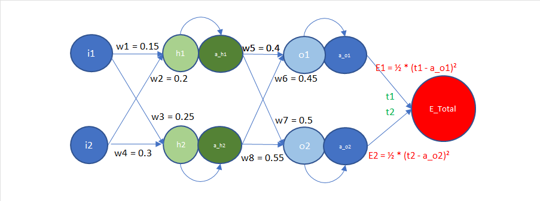
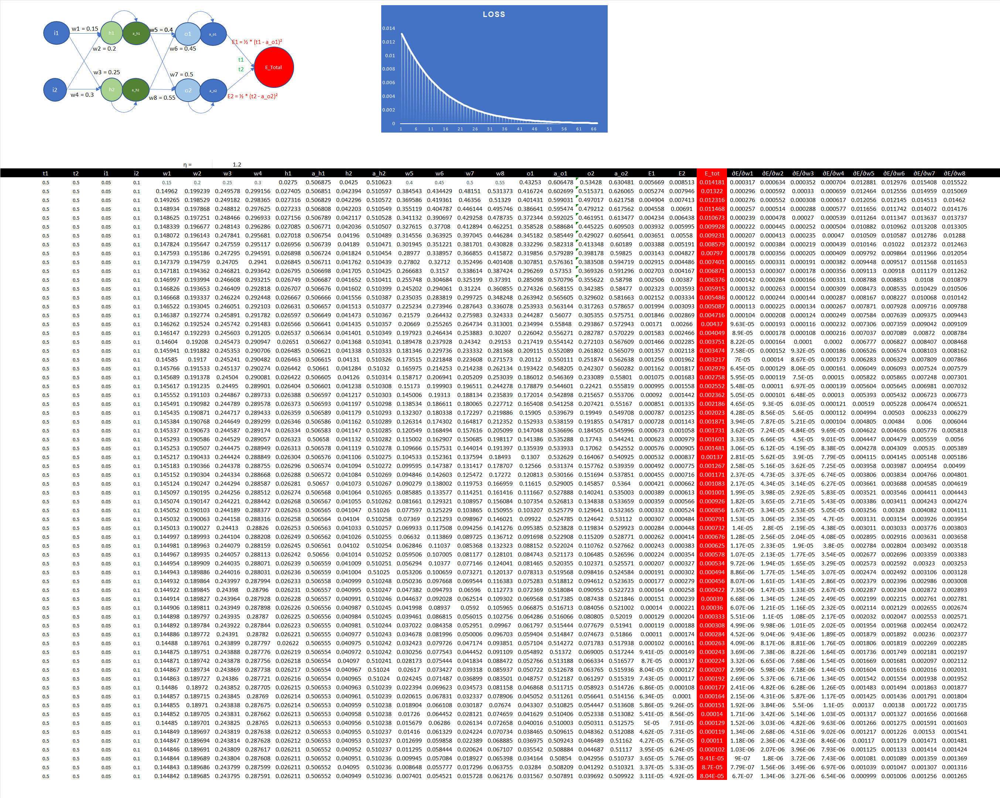
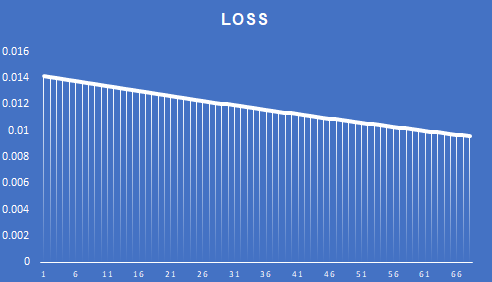
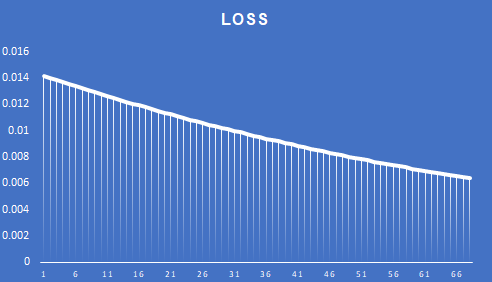
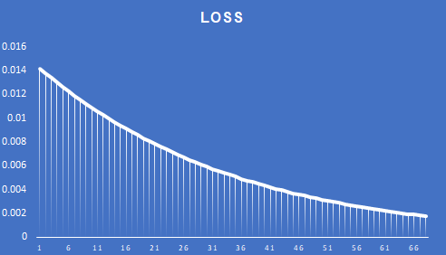
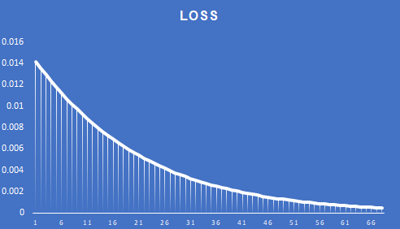
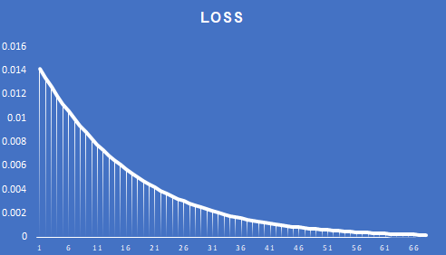
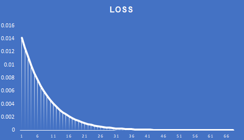
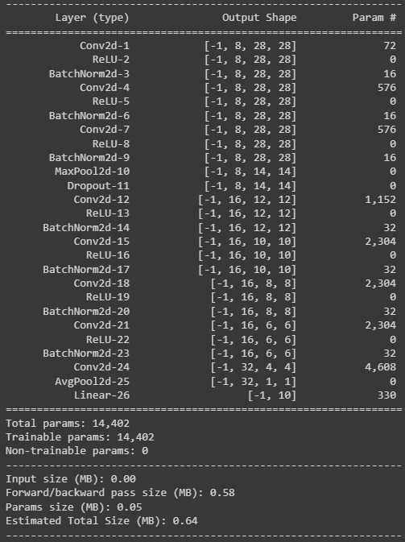
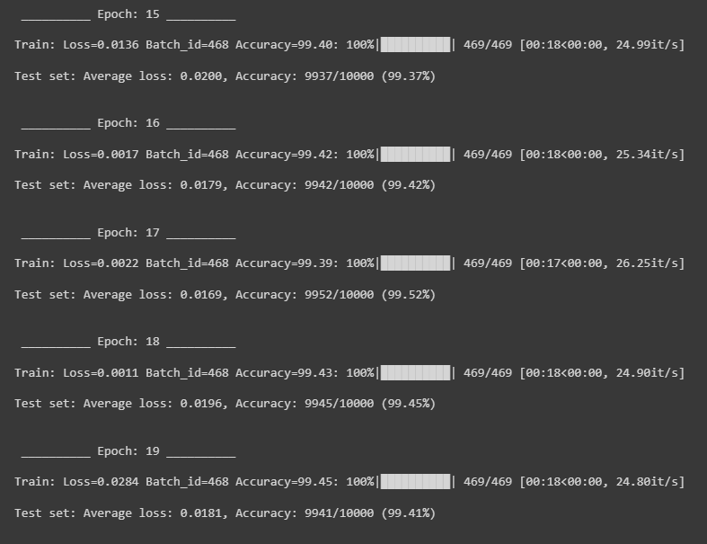

---
# Assignment #6 [Part 1]
#### In this assignment we are rewriting the excel sheet explaining the BackPropagation step by step.

Here we consider a simple neural network with 2 inputs i1 and i2, having 2 outputs a_o1 and a_o2. w1-w8 are the weights of the model.
We are adding sigmoid as the activation function.
We calculate 2 losses (L2 loss) for the output with respect to the targets t1 and t2.
The total loss is the sum of the two losses E1 and E2.

The following image shows the model used for this example.

The partial derivative equations for the total loss with respect to the weights are mentioned below.

$\frac{\partial E_{\text{total}}}{\partial w_1} = \left((a_{01} - t_1) \cdot a_{o1} \cdot (1 - a_{o1}) \cdot w_5 + (a_{02} - t_2) \cdot a_{o2} \cdot (1 - a_{o2}) \cdot w_7\right) \cdot a_{h1} \cdot (1 - a_{h1}) \cdot i_1$

$\frac{\partial E_{\text{total}}}{\partial w_2} = \left((a_{01} - t_1) \cdot a_{o1} \cdot (1 - a_{o1}) \cdot w_5 + (a_{02} - t_2) \cdot a_{o2} \cdot (1 - a_{o2}) \cdot w_7\right) \cdot a_{h1} \cdot (1 - a_{h1}) \cdot i_2$

$\frac{\partial E_{\text{total}}}{\partial w_3} = \left((a_{01} - t_1) \cdot a_{o1} \cdot (1 - a_{o1}) \cdot w_6 + (a_{02} - t_2) \cdot a_{o2} \cdot (1 - a_{o2}) \cdot w_8\right) \cdot a_{h2} \cdot (1 - a_{h2}) \cdot i_1$

$\frac{\partial E_{\text{total}}}{\partial w_4} = \left((a_{01} - t_1) \cdot a_{o1} \cdot (1 - a_{o1}) \cdot w_6 + (a_{02} - t_2) \cdot a_{o2} \cdot (1 - a_{o2}) \cdot w_8\right) \cdot a_{h2} \cdot (1 - a_{h2}) \cdot i_2$

$\frac{\partial E_{\text{total}}}{\partial w_5} = (a_{01} - t_1) \cdot a_{o1} \cdot (1 - a_{o1}) \cdot a_{h1}$

$\frac{\partial E_{\text{total}}}{\partial w_6} = (a_{01} - t_1) \cdot a_{o1} \cdot (1 - a_{o1}) \cdot a_{h2}$

$\frac{\partial E_{\text{total}}}{\partial w_7} = (a_{02} - t_2) \cdot a_{o2} \cdot (1 - a_{o2}) \cdot a_{h1}$

$\frac{\partial E_{\text{total}}}{\partial w_8} = (a_{02} - t_2) \cdot a_{o2} \cdot (1 - a_{o2}) \cdot a_{h2}$

The following image shows the excel sheet where the calculation for BackPropagation is explained.

The following images shows the error graph for different learning rates.

1. Learning Rate = 0.1
    

2. Learning Rate = 0.2
    

3. Learning Rate = 0.5
    

4. Learning Rate = 0.8
    

5. Learning Rate = 1
    

6. Learning Rate = 2
    

---

# Assignment #6 [Part 2]
#### In this assignment we are going to train the MNIST dataset and we have to achieve 99.4% validation accuracy using less than 20K parameters under 20 epochs.

The model architecture is composed of a sequence of convolutional layers, incorporating batch normalization, ReLU activation functions, max-pooling, and dropout layers to mitigate overfitting. 

The architecture commences with an initial convolutional layer producing 8 output channels, followed by two additional convolutional blocks generating 8, 16, and 32 output channels, respectively. 

Each convolutional block is succeeded by max-pooling operations, enhancing the receptive field and decreasing spatial dimensions. 

Following the convolutional layers, a global average pooling layer is employed to compress spatial dimensions to 1x1, and a fully connected (FC) layer is utilized to map features to the respective output classes. 

The entire model encompasses a total of 14,402 parameters.

The following image shows the summary of the model:

the resultant test accuracy of the model from the last 5 epoch is shown below, The highest being 99.52% in the 17th epoch.

