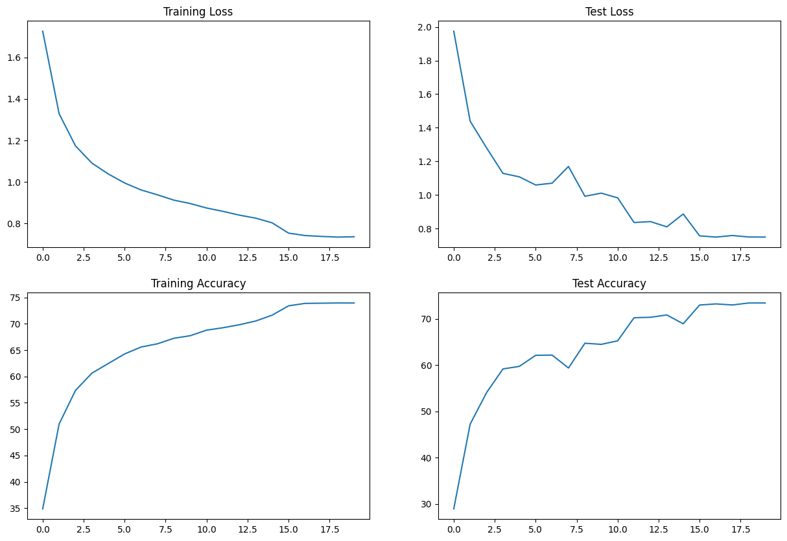
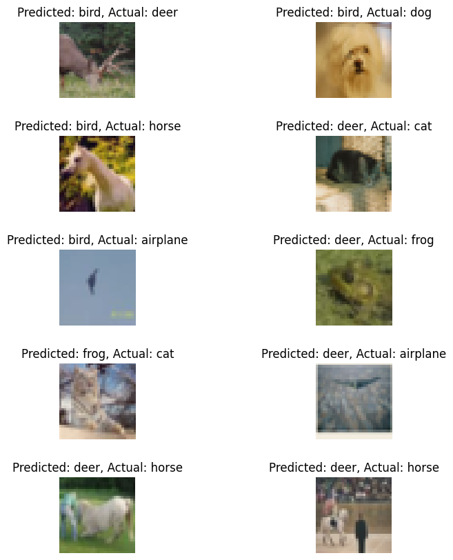
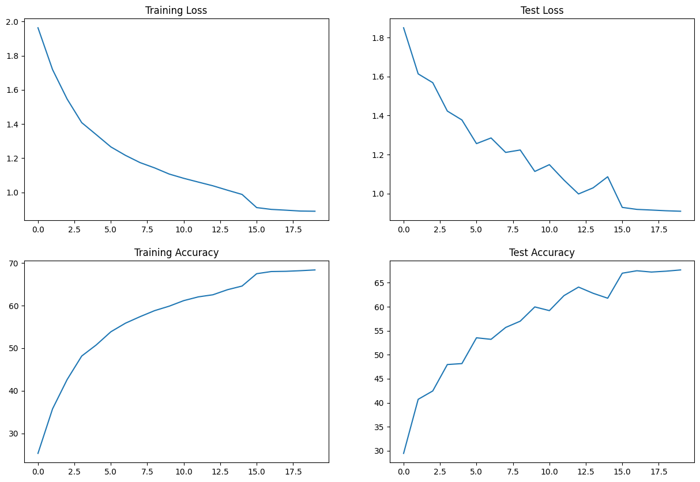
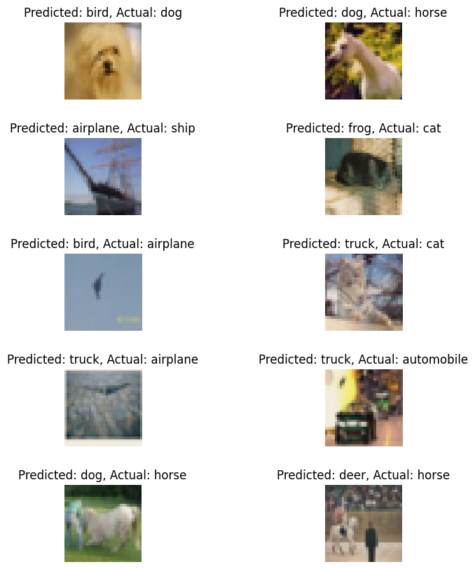
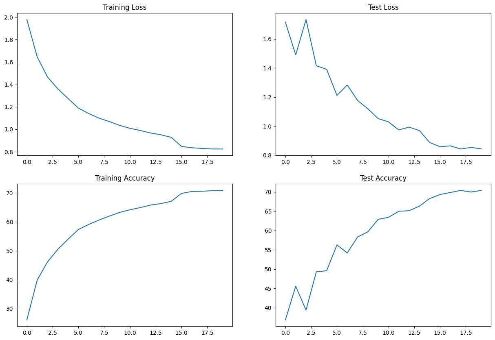
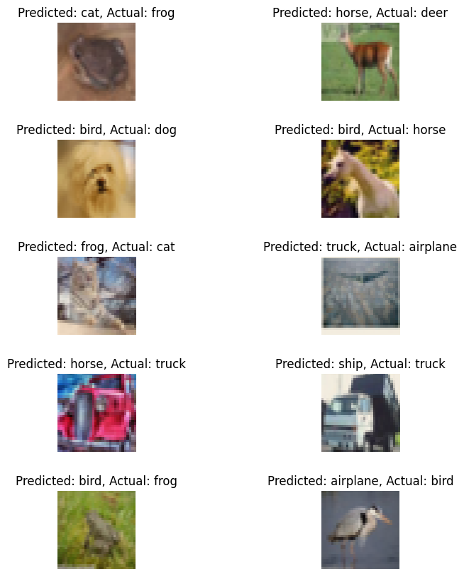

# Assignment #8 [ERA v2]

### Abstract
In this assignment we are going to train the CIFAR10 dataset to achieve 70% validation accuracy using less than 50,000 parameters under 20 epochs.
CIFAR10 dataset has image size of 32x32x3 and has 10 classes

### Summary
All the models except Layer Normalization trained on CFAR10 dataset was able to acheive above 70% validation accuract using less than 50K parameter under 20 epoch.
The model that used Batch Normalization had the Best Test Accuracy **73.42%** , Then the Group Normalization **70.36%** and the Layer Normalization was able to acheive **67.66%** validation accuracy.
All the models did perform well with respect to overfitting issue.

## Model #1 [Batch Normalization]

#### Model Summary
    
    Using CUDA!
    ----------------------------------------------------------------
            Layer (type)               Output Shape         Param #
    ================================================================
                Conv2d-1            [-1, 8, 32, 32]             216
           BatchNorm2d-2            [-1, 8, 32, 32]              16
                  ReLU-3            [-1, 8, 32, 32]               0
               Dropout-4            [-1, 8, 32, 32]               0
                Conv2d-5           [-1, 16, 32, 32]           1,152
           BatchNorm2d-6           [-1, 16, 32, 32]              32
                  ReLU-7           [-1, 16, 32, 32]               0
               Dropout-8           [-1, 16, 32, 32]               0
                Conv2d-9            [-1, 8, 32, 32]             128
            MaxPool2d-10            [-1, 8, 16, 16]               0
               Conv2d-11           [-1, 16, 16, 16]           1,152
          BatchNorm2d-12           [-1, 16, 16, 16]              32
                 ReLU-13           [-1, 16, 16, 16]               0
              Dropout-14           [-1, 16, 16, 16]               0
               Conv2d-15           [-1, 32, 16, 16]           4,608
          BatchNorm2d-16           [-1, 32, 16, 16]              64
                 ReLU-17           [-1, 32, 16, 16]               0
              Dropout-18           [-1, 32, 16, 16]               0
               Conv2d-19           [-1, 32, 16, 16]           9,216
          BatchNorm2d-20           [-1, 32, 16, 16]              64
                 ReLU-21           [-1, 32, 16, 16]               0
              Dropout-22           [-1, 32, 16, 16]               0
               Conv2d-23            [-1, 8, 16, 16]             256
            MaxPool2d-24              [-1, 8, 8, 8]               0
               Conv2d-25             [-1, 16, 8, 8]           1,152
          BatchNorm2d-26             [-1, 16, 8, 8]              32
                 ReLU-27             [-1, 16, 8, 8]               0
              Dropout-28             [-1, 16, 8, 8]               0
               Conv2d-29             [-1, 32, 8, 8]           4,608
          BatchNorm2d-30             [-1, 32, 8, 8]              64
                 ReLU-31             [-1, 32, 8, 8]               0
              Dropout-32             [-1, 32, 8, 8]               0
               Conv2d-33             [-1, 64, 8, 8]          18,432
          BatchNorm2d-34             [-1, 64, 8, 8]             128
                 ReLU-35             [-1, 64, 8, 8]               0
              Dropout-36             [-1, 64, 8, 8]               0
            AvgPool2d-37             [-1, 64, 1, 1]               0
               Conv2d-38             [-1, 10, 1, 1]             640
    ================================================================
    Total params: 41,992
    Trainable params: 41,992
    Non-trainable params: 0
    ----------------------------------------------------------------
    Input size (MB): 0.01
    Forward/backward pass size (MB): 1.69
    Params size (MB): 0.16
    Estimated Total Size (MB): 1.86
    ----------------------------------------------------------------

#### Training Status

    Epoch :  15
    Train: Loss=0.7957 Batch_id=390 Accuracy=73.41: 100%|██████████| 391/391 [00:15<00:00, 24.89it/s]
    Test set: Average loss: 0.7562, Accuracy: 7298/10000 (72.98%)

    Epoch :  16
    Train: Loss=0.6294 Batch_id=390 Accuracy=73.86: 100%|██████████| 391/391 [00:15<00:00, 24.89it/s]
    Test set: Average loss: 0.7489, Accuracy: 7322/10000 (73.22%)

    Epoch :  17
    Train: Loss=0.6556 Batch_id=390 Accuracy=73.90: 100%|██████████| 391/391 [00:15<00:00, 24.62it/s]
    Test set: Average loss: 0.7583, Accuracy: 7299/10000 (72.99%)

    Epoch :  18
    Train: Loss=0.5432 Batch_id=390 Accuracy=73.94: 100%|██████████| 391/391 [00:15<00:00, 24.65it/s]
    Test set: Average loss: 0.7495, Accuracy: 7342/10000 (73.42%)

    Epoch :  19
    Train: Loss=0.8457 Batch_id=390 Accuracy=73.94: 100%|██████████| 391/391 [00:16<00:00, 24.33it/s]
    Test set: Average loss: 0.7489, Accuracy: 7342/10000 (73.42%)

### Analyze Training, Testing Loss and Accuracy

### Misclassified Images

## Model #2 [Layer Normalization]

#### Model Summary

    Using CUDA!
    ----------------------------------------------------------------
            Layer (type)               Output Shape         Param #
    ================================================================
                Conv2d-1            [-1, 8, 32, 32]             216
             LayerNorm-2            [-1, 8, 32, 32]          16,384
                  ReLU-3            [-1, 8, 32, 32]               0
               Dropout-4            [-1, 8, 32, 32]               0
                Conv2d-5           [-1, 16, 32, 32]           1,152
             LayerNorm-6           [-1, 16, 32, 32]          32,768
                  ReLU-7           [-1, 16, 32, 32]               0
               Dropout-8           [-1, 16, 32, 32]               0
                Conv2d-9            [-1, 8, 32, 32]             128
            MaxPool2d-10            [-1, 8, 16, 16]               0
               Conv2d-11           [-1, 16, 16, 16]           1,152
            LayerNorm-12           [-1, 16, 16, 16]           8,192
                 ReLU-13           [-1, 16, 16, 16]               0
              Dropout-14           [-1, 16, 16, 16]               0
               Conv2d-15           [-1, 32, 16, 16]           4,608
            LayerNorm-16           [-1, 32, 16, 16]          16,384
                 ReLU-17           [-1, 32, 16, 16]               0
              Dropout-18           [-1, 32, 16, 16]               0
               Conv2d-19           [-1, 32, 16, 16]           9,216
            LayerNorm-20           [-1, 32, 16, 16]          16,384
                 ReLU-21           [-1, 32, 16, 16]               0
              Dropout-22           [-1, 32, 16, 16]               0
               Conv2d-23            [-1, 8, 16, 16]             256
            MaxPool2d-24              [-1, 8, 8, 8]               0
               Conv2d-25             [-1, 16, 8, 8]           1,152
            LayerNorm-26             [-1, 16, 8, 8]           2,048
                 ReLU-27             [-1, 16, 8, 8]               0
              Dropout-28             [-1, 16, 8, 8]               0
               Conv2d-29             [-1, 32, 8, 8]           4,608
            LayerNorm-30             [-1, 32, 8, 8]           4,096
                 ReLU-31             [-1, 32, 8, 8]               0
              Dropout-32             [-1, 32, 8, 8]               0
               Conv2d-33             [-1, 64, 8, 8]          18,432
            LayerNorm-34             [-1, 64, 8, 8]           8,192
                 ReLU-35             [-1, 64, 8, 8]               0
              Dropout-36             [-1, 64, 8, 8]               0
            AvgPool2d-37             [-1, 64, 1, 1]               0
               Conv2d-38             [-1, 10, 1, 1]             640
    ================================================================
    Total params: 146,008
    Trainable params: 146,008
    Non-trainable params: 0
    ----------------------------------------------------------------
    Input size (MB): 0.01
    Forward/backward pass size (MB): 1.69
    Params size (MB): 0.56
    Estimated Total Size (MB): 2.26
    ----------------------------------------------------------------

#### Training Status

    Epoch :  15
    Train: Loss=0.7901 Batch_id=390 Accuracy=67.50: 100%|██████████| 391/391 [00:16<00:00, 24.36it/s]
    Test set: Average loss: 0.9284, Accuracy: 6698/10000 (66.98%)

    Epoch :  16
    Train: Loss=0.8355 Batch_id=390 Accuracy=68.01: 100%|██████████| 391/391 [00:15<00:00, 25.27it/s]
    Test set: Average loss: 0.9182, Accuracy: 6749/10000 (67.49%)

    Epoch :  17
    Train: Loss=0.7306 Batch_id=390 Accuracy=68.07: 100%|██████████| 391/391 [00:15<00:00, 25.15it/s]
    Test set: Average loss: 0.9148, Accuracy: 6722/10000 (67.22%)

    Epoch :  18
    Train: Loss=0.7163 Batch_id=390 Accuracy=68.21: 100%|██████████| 391/391 [00:15<00:00, 24.48it/s]
    Test set: Average loss: 0.9112, Accuracy: 6740/10000 (67.40%)

    Epoch :  19
    Train: Loss=0.9843 Batch_id=390 Accuracy=68.39: 100%|██████████| 391/391 [00:15<00:00, 24.59it/s]
    Test set: Average loss: 0.9087, Accuracy: 6766/10000 (67.66%)

### Analyze Training, Testing Loss and Accuracy

### Misclassified Images

## Model #3 [Group Normalization]

#### Model Summary

    Using CUDA!
    ----------------------------------------------------------------
            Layer (type)               Output Shape         Param #
    ================================================================
                Conv2d-1            [-1, 8, 32, 32]             216
             GroupNorm-2            [-1, 8, 32, 32]              16
                  ReLU-3            [-1, 8, 32, 32]               0
               Dropout-4            [-1, 8, 32, 32]               0
                Conv2d-5           [-1, 16, 32, 32]           1,152
             GroupNorm-6           [-1, 16, 32, 32]              32
                  ReLU-7           [-1, 16, 32, 32]               0
               Dropout-8           [-1, 16, 32, 32]               0
                Conv2d-9            [-1, 8, 32, 32]             128
            MaxPool2d-10            [-1, 8, 16, 16]               0
               Conv2d-11           [-1, 16, 16, 16]           1,152
            GroupNorm-12           [-1, 16, 16, 16]              32
                 ReLU-13           [-1, 16, 16, 16]               0
              Dropout-14           [-1, 16, 16, 16]               0
               Conv2d-15           [-1, 32, 16, 16]           4,608
            GroupNorm-16           [-1, 32, 16, 16]              64
                 ReLU-17           [-1, 32, 16, 16]               0
              Dropout-18           [-1, 32, 16, 16]               0
               Conv2d-19           [-1, 32, 16, 16]           9,216
            GroupNorm-20           [-1, 32, 16, 16]              64
                 ReLU-21           [-1, 32, 16, 16]               0
              Dropout-22           [-1, 32, 16, 16]               0
               Conv2d-23            [-1, 8, 16, 16]             256
            MaxPool2d-24              [-1, 8, 8, 8]               0
               Conv2d-25             [-1, 16, 8, 8]           1,152
            GroupNorm-26             [-1, 16, 8, 8]              32
                 ReLU-27             [-1, 16, 8, 8]               0
              Dropout-28             [-1, 16, 8, 8]               0
               Conv2d-29             [-1, 32, 8, 8]           4,608
            GroupNorm-30             [-1, 32, 8, 8]              64
                 ReLU-31             [-1, 32, 8, 8]               0
              Dropout-32             [-1, 32, 8, 8]               0
               Conv2d-33             [-1, 64, 8, 8]          18,432
            GroupNorm-34             [-1, 64, 8, 8]             128
                 ReLU-35             [-1, 64, 8, 8]               0
              Dropout-36             [-1, 64, 8, 8]               0
            AvgPool2d-37             [-1, 64, 1, 1]               0
               Conv2d-38             [-1, 10, 1, 1]             640
    ================================================================
    Total params: 41,992
    Trainable params: 41,992
    Non-trainable params: 0
    ----------------------------------------------------------------
    Input size (MB): 0.01
    Forward/backward pass size (MB): 1.69
    Params size (MB): 0.16
    Estimated Total Size (MB): 1.86
    ----------------------------------------------------------------

#### Training Status

    Epoch :  15
    Train: Loss=0.8229 Batch_id=390 Accuracy=69.84: 100%|██████████| 391/391 [00:17<00:00, 22.97it/s]
    Test set: Average loss: 0.8581, Accuracy: 6930/10000 (69.30%)

    Epoch :  16
    Train: Loss=0.5774 Batch_id=390 Accuracy=70.51: 100%|██████████| 391/391 [00:16<00:00, 23.14it/s]
    Test set: Average loss: 0.8639, Accuracy: 6982/10000 (69.82%)

    Epoch :  17
    Train: Loss=0.6575 Batch_id=390 Accuracy=70.59: 100%|██████████| 391/391 [00:15<00:00, 24.86it/s]
    Test set: Average loss: 0.8423, Accuracy: 7036/10000 (70.36%)

    Epoch :  18
    Train: Loss=0.7792 Batch_id=390 Accuracy=70.79: 100%|██████████| 391/391 [00:17<00:00, 22.89it/s]
    Test set: Average loss: 0.8532, Accuracy: 6995/10000 (69.95%)

    Epoch :  19
    Train: Loss=0.9172 Batch_id=390 Accuracy=70.88: 100%|██████████| 391/391 [00:15<00:00, 24.62it/s]
    Test set: Average loss: 0.8437, Accuracy: 7036/10000 (70.36%)

### Analyze Training, Testing Loss and Accuracy

### Misclassified Images

