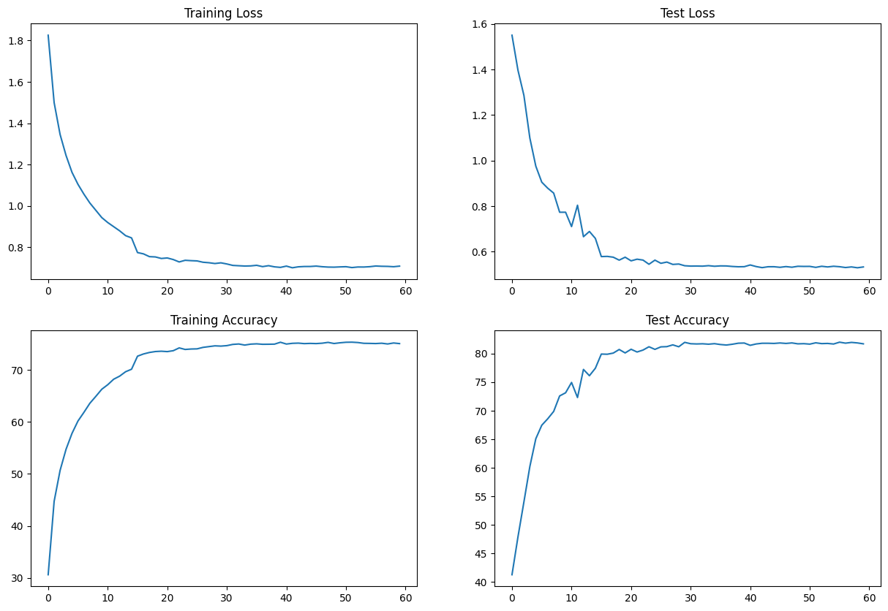

# Assignment #9 [ERA v2]

### Abstract
In this assignment we are going to train the CIFAR10 dataset to achieve 85% validation accuracy using less than 20,000 parameters, In this assignment there is no restriction on the number of epoch.
CIFAR10 dataset has image size of 32x32x3 and has 10 classes [airplane, automobile, bird, cat, deer, dog, frog, horse, ship, and truck]

Write a new network that
• has the architecture to C1C2C3C40 (No MaxPooling, but 3 3x3 layers with stride of 2 instead) (Figure out how to use Dilated kernels here instead of MP or strided convolution)
• total RF must be more than 44
• one of the layers must use Depthwise Separable Convolution
• one of the layers must use Dilated Convolution
• use GAP (compulsory):- add FC after GAP to target #of classes (optional)
• use argumentation library and apply:
    • horizontal flip
    • shiftScaleRotate
    • coarseDropout (max_holes = 1, max_height=16px, max_width=1, min_holes = 1, min_height=16px, min_width=16px, fill_value=(mean of your dataset), mask_fill_value = None)
• achieve 85% accuracy, as many epochs as you want. Total Params to be less than 200k.

### Summary
The model was able to acheive an accuracy of 82% using 182,368 params.

#### Model Summary
    ----------------------------------------------------------------
            Layer (type)               Output Shape         Param #
    ================================================================
                Conv2d-1           [-1, 32, 32, 32]             864
           BatchNorm2d-2           [-1, 32, 32, 32]              64
                  ReLU-3           [-1, 32, 32, 32]               0
               Dropout-4           [-1, 32, 32, 32]               0
                Conv2d-5           [-1, 32, 32, 32]           9,216
           BatchNorm2d-6           [-1, 32, 32, 32]              64
                  ReLU-7           [-1, 32, 32, 32]               0
               Dropout-8           [-1, 32, 32, 32]               0
                Conv2d-9           [-1, 32, 30, 30]           9,216
          BatchNorm2d-10           [-1, 32, 30, 30]              64
                 ReLU-11           [-1, 32, 30, 30]               0
              Dropout-12           [-1, 32, 30, 30]               0
               Conv2d-13           [-1, 32, 30, 30]           9,216
          BatchNorm2d-14           [-1, 32, 30, 30]              64
                 ReLU-15           [-1, 32, 30, 30]               0
              Dropout-16           [-1, 32, 30, 30]               0
               Conv2d-17           [-1, 32, 30, 30]           9,216
          BatchNorm2d-18           [-1, 32, 30, 30]              64
                 ReLU-19           [-1, 32, 30, 30]               0
              Dropout-20           [-1, 32, 30, 30]               0
               Conv2d-21           [-1, 64, 15, 15]          18,432
          BatchNorm2d-22           [-1, 64, 15, 15]             128
                 ReLU-23           [-1, 64, 15, 15]               0
              Dropout-24           [-1, 64, 15, 15]               0
               Conv2d-25           [-1, 64, 15, 15]          36,864
          BatchNorm2d-26           [-1, 64, 15, 15]             128
                 ReLU-27           [-1, 64, 15, 15]               0
              Dropout-28           [-1, 64, 15, 15]               0
               Conv2d-29           [-1, 32, 15, 15]           2,048
          BatchNorm2d-30           [-1, 32, 15, 15]              64
                 ReLU-31           [-1, 32, 15, 15]               0
              Dropout-32           [-1, 32, 15, 15]               0
               Conv2d-33             [-1, 32, 8, 8]           9,216
          BatchNorm2d-34             [-1, 32, 8, 8]              64
                 ReLU-35             [-1, 32, 8, 8]               0
              Dropout-36             [-1, 32, 8, 8]               0
               Conv2d-37             [-1, 32, 8, 8]             576
               Conv2d-38             [-1, 64, 8, 8]           2,048
          BatchNorm2d-39             [-1, 64, 8, 8]             128
                 ReLU-40             [-1, 64, 8, 8]               0
              Dropout-41             [-1, 64, 8, 8]               0
               Conv2d-42             [-1, 64, 8, 8]          36,864
          BatchNorm2d-43             [-1, 64, 8, 8]             128
                 ReLU-44             [-1, 64, 8, 8]               0
              Dropout-45             [-1, 64, 8, 8]               0
               Conv2d-46             [-1, 64, 8, 8]          36,864
          BatchNorm2d-47             [-1, 64, 8, 8]             128
                 ReLU-48             [-1, 64, 8, 8]               0
              Dropout-49             [-1, 64, 8, 8]               0
            AvgPool2d-50             [-1, 64, 1, 1]               0
               Conv2d-51             [-1, 10, 1, 1]             640
    ================================================================
    Total params: 182,368
    Trainable params: 182,368
    Non-trainable params: 0
    ----------------------------------------------------------------
    Input size (MB): 0.01
    Forward/backward pass size (MB): 6.19
    Params size (MB): 0.70
    Estimated Total Size (MB): 6.90
    ----------------------------------------------------------------

#### Training Status
    Epoch :  0
    Train: Loss=1.6922 Batch_id=390 Accuracy=30.62: 100%|██████████| 391/391 [00:18<00:00, 21.39it/s]
    Test set: Average loss: 1.5508, Accuracy: 4129/10000 (41.29%)

    Epoch :  1
    Train: Loss=1.4661 Batch_id=390 Accuracy=44.72: 100%|██████████| 391/391 [00:17<00:00, 22.62it/s]
    Test set: Average loss: 1.3973, Accuracy: 4790/10000 (47.90%)

    Epoch :  2
    Train: Loss=1.3771 Batch_id=390 Accuracy=50.67: 100%|██████████| 391/391 [00:18<00:00, 21.58it/s]
    Test set: Average loss: 1.2864, Accuracy: 5403/10000 (54.03%)

    Epoch :  3
    Train: Loss=1.0862 Batch_id=390 Accuracy=54.74: 100%|██████████| 391/391 [00:17<00:00, 22.84it/s]
    Test set: Average loss: 1.0988, Accuracy: 6024/10000 (60.24%)

    Epoch :  4
    Train: Loss=1.0785 Batch_id=390 Accuracy=57.79: 100%|██████████| 391/391 [00:18<00:00, 21.11it/s]
    Test set: Average loss: 0.9754, Accuracy: 6510/10000 (65.10%)

    Epoch :  5
    Train: Loss=1.3366 Batch_id=390 Accuracy=60.16: 100%|██████████| 391/391 [00:17<00:00, 22.28it/s]
    Test set: Average loss: 0.9050, Accuracy: 6746/10000 (67.46%)

    Epoch :  6
    Train: Loss=1.1541 Batch_id=390 Accuracy=61.83: 100%|██████████| 391/391 [00:17<00:00, 21.86it/s]
    Test set: Average loss: 0.8786, Accuracy: 6859/10000 (68.59%)

    Epoch :  7
    Train: Loss=0.9252 Batch_id=390 Accuracy=63.58: 100%|██████████| 391/391 [00:17<00:00, 22.61it/s]
    Test set: Average loss: 0.8570, Accuracy: 6988/10000 (69.88%)

    Epoch :  8
    Train: Loss=0.9901 Batch_id=390 Accuracy=64.90: 100%|██████████| 391/391 [00:17<00:00, 22.80it/s]
    Test set: Average loss: 0.7729, Accuracy: 7259/10000 (72.59%)

    Epoch :  9
    Train: Loss=0.7887 Batch_id=390 Accuracy=66.27: 100%|██████████| 391/391 [00:17<00:00, 22.86it/s]
    Test set: Average loss: 0.7729, Accuracy: 7314/10000 (73.14%)

    Epoch :  10
    Train: Loss=0.9441 Batch_id=390 Accuracy=67.14: 100%|██████████| 391/391 [00:17<00:00, 22.91it/s]
    Test set: Average loss: 0.7099, Accuracy: 7495/10000 (74.95%)

    Epoch :  11
    Train: Loss=0.7521 Batch_id=390 Accuracy=68.20: 100%|██████████| 391/391 [00:17<00:00, 22.97it/s]
    Test set: Average loss: 0.8037, Accuracy: 7231/10000 (72.31%)

    Epoch :  12
    Train: Loss=0.9351 Batch_id=390 Accuracy=68.79: 100%|██████████| 391/391 [00:16<00:00, 23.12it/s]
    Test set: Average loss: 0.6654, Accuracy: 7723/10000 (77.23%)

    Epoch :  13
    Train: Loss=0.6792 Batch_id=390 Accuracy=69.64: 100%|██████████| 391/391 [00:16<00:00, 23.17it/s]
    Test set: Average loss: 0.6884, Accuracy: 7613/10000 (76.13%)

    Epoch :  14
    Train: Loss=0.8566 Batch_id=390 Accuracy=70.12: 100%|██████████| 391/391 [00:17<00:00, 21.81it/s]
    Test set: Average loss: 0.6578, Accuracy: 7744/10000 (77.44%)

    Epoch :  15
    Train: Loss=0.7930 Batch_id=390 Accuracy=72.63: 100%|██████████| 391/391 [00:17<00:00, 22.22it/s]
    Test set: Average loss: 0.5780, Accuracy: 7992/10000 (79.92%)

    Epoch :  16
    Train: Loss=0.6541 Batch_id=390 Accuracy=73.05: 100%|██████████| 391/391 [00:17<00:00, 22.95it/s]
    Test set: Average loss: 0.5788, Accuracy: 7989/10000 (79.89%)

    Epoch :  17
    Train: Loss=0.6282 Batch_id=390 Accuracy=73.34: 100%|██████████| 391/391 [00:17<00:00, 22.49it/s]
    Test set: Average loss: 0.5753, Accuracy: 8009/10000 (80.09%)

    Epoch :  18
    Train: Loss=0.9369 Batch_id=390 Accuracy=73.52: 100%|██████████| 391/391 [00:17<00:00, 22.72it/s]
    Test set: Average loss: 0.5624, Accuracy: 8072/10000 (80.72%)

    Epoch :  19
    Train: Loss=0.7423 Batch_id=390 Accuracy=73.58: 100%|██████████| 391/391 [00:17<00:00, 21.90it/s]
    Test set: Average loss: 0.5752, Accuracy: 8012/10000 (80.12%)

    Epoch :  20
    Train: Loss=0.7084 Batch_id=390 Accuracy=73.51: 100%|██████████| 391/391 [00:17<00:00, 22.48it/s]
    Test set: Average loss: 0.5593, Accuracy: 8076/10000 (80.76%)

    Epoch :  21
    Train: Loss=0.7401 Batch_id=390 Accuracy=73.68: 100%|██████████| 391/391 [00:18<00:00, 20.93it/s]
    Test set: Average loss: 0.5665, Accuracy: 8028/10000 (80.28%)

    Epoch :  22
    Train: Loss=0.8202 Batch_id=390 Accuracy=74.22: 100%|██████████| 391/391 [00:17<00:00, 22.17it/s]
    Test set: Average loss: 0.5626, Accuracy: 8062/10000 (80.62%)

    Epoch :  23
    Train: Loss=0.5670 Batch_id=390 Accuracy=73.92: 100%|██████████| 391/391 [00:20<00:00, 19.11it/s]
    Test set: Average loss: 0.5443, Accuracy: 8120/10000 (81.20%)

    Epoch :  24
    Train: Loss=0.9844 Batch_id=390 Accuracy=74.00: 100%|██████████| 391/391 [00:17<00:00, 22.85it/s]
    Test set: Average loss: 0.5624, Accuracy: 8074/10000 (80.74%)

    Epoch :  25
    Train: Loss=0.8097 Batch_id=390 Accuracy=74.03: 100%|██████████| 391/391 [00:17<00:00, 22.16it/s]
    Test set: Average loss: 0.5485, Accuracy: 8118/10000 (81.18%)

    Epoch :  26
    Train: Loss=0.5756 Batch_id=390 Accuracy=74.32: 100%|██████████| 391/391 [00:17<00:00, 22.84it/s]
    Test set: Average loss: 0.5539, Accuracy: 8122/10000 (81.22%)

    Epoch :  27
    Train: Loss=0.9191 Batch_id=390 Accuracy=74.47: 100%|██████████| 391/391 [00:17<00:00, 21.97it/s]
    Test set: Average loss: 0.5436, Accuracy: 8153/10000 (81.53%)

    Epoch :  28
    Train: Loss=0.7293 Batch_id=390 Accuracy=74.61: 100%|██████████| 391/391 [00:18<00:00, 20.89it/s]
    Test set: Average loss: 0.5452, Accuracy: 8120/10000 (81.20%)

    Epoch :  29
    Train: Loss=0.8481 Batch_id=390 Accuracy=74.56: 100%|██████████| 391/391 [00:17<00:00, 22.62it/s]
    Test set: Average loss: 0.5378, Accuracy: 8197/10000 (81.97%)

    Epoch :  30
    Train: Loss=0.6486 Batch_id=390 Accuracy=74.65: 100%|██████████| 391/391 [00:17<00:00, 22.25it/s]
    Test set: Average loss: 0.5362, Accuracy: 8173/10000 (81.73%)

    Epoch :  31
    Train: Loss=0.7452 Batch_id=390 Accuracy=74.89: 100%|██████████| 391/391 [00:17<00:00, 22.53it/s]
    Test set: Average loss: 0.5364, Accuracy: 8169/10000 (81.69%)

    Epoch :  32
    Train: Loss=0.7812 Batch_id=390 Accuracy=74.97: 100%|██████████| 391/391 [00:17<00:00, 22.71it/s]
    Test set: Average loss: 0.5360, Accuracy: 8172/10000 (81.72%)

    Epoch :  33
    Train: Loss=0.8501 Batch_id=390 Accuracy=74.76: 100%|██████████| 391/391 [00:17<00:00, 21.80it/s]
    Test set: Average loss: 0.5381, Accuracy: 8165/10000 (81.65%)

    Epoch :  34
    Train: Loss=0.8548 Batch_id=390 Accuracy=74.94: 100%|██████████| 391/391 [00:17<00:00, 22.22it/s]
    Test set: Average loss: 0.5355, Accuracy: 8174/10000 (81.74%)

    Epoch :  35
    Train: Loss=0.9400 Batch_id=390 Accuracy=75.00: 100%|██████████| 391/391 [00:18<00:00, 21.67it/s]
    Test set: Average loss: 0.5371, Accuracy: 8159/10000 (81.59%)

    Epoch :  36
    Train: Loss=0.6943 Batch_id=390 Accuracy=74.91: 100%|██████████| 391/391 [00:18<00:00, 21.52it/s]
    Test set: Average loss: 0.5368, Accuracy: 8150/10000 (81.50%)

    Epoch :  37
    Train: Loss=0.6078 Batch_id=390 Accuracy=74.92: 100%|██████████| 391/391 [00:17<00:00, 22.77it/s]
    Test set: Average loss: 0.5346, Accuracy: 8164/10000 (81.64%)

    Epoch :  38
    Train: Loss=1.0410 Batch_id=390 Accuracy=74.94: 100%|██████████| 391/391 [00:18<00:00, 21.60it/s]
    Test set: Average loss: 0.5332, Accuracy: 8182/10000 (81.82%)

    Epoch :  39
    Train: Loss=0.7806 Batch_id=390 Accuracy=75.30: 100%|██████████| 391/391 [00:17<00:00, 22.34it/s]
    Test set: Average loss: 0.5336, Accuracy: 8185/10000 (81.85%)

    Epoch :  40
    Train: Loss=0.5951 Batch_id=390 Accuracy=74.96: 100%|██████████| 391/391 [00:17<00:00, 21.74it/s]
    Test set: Average loss: 0.5412, Accuracy: 8145/10000 (81.45%)

    Epoch :  41
    Train: Loss=0.7608 Batch_id=390 Accuracy=75.10: 100%|██████████| 391/391 [00:17<00:00, 22.74it/s]
    Test set: Average loss: 0.5342, Accuracy: 8169/10000 (81.69%)

    Epoch :  42
    Train: Loss=0.6936 Batch_id=390 Accuracy=75.14: 100%|██████████| 391/391 [00:19<00:00, 19.84it/s]
    Test set: Average loss: 0.5294, Accuracy: 8181/10000 (81.81%)

    Epoch :  43
    Train: Loss=0.7083 Batch_id=390 Accuracy=75.04: 100%|██████████| 391/391 [00:17<00:00, 21.81it/s]
    Test set: Average loss: 0.5333, Accuracy: 8181/10000 (81.81%)

    Epoch :  44
    Train: Loss=0.8976 Batch_id=390 Accuracy=75.08: 100%|██████████| 391/391 [00:18<00:00, 20.77it/s]
    Test set: Average loss: 0.5334, Accuracy: 8178/10000 (81.78%)

    Epoch :  45
    Train: Loss=0.5229 Batch_id=390 Accuracy=75.05: 100%|██████████| 391/391 [00:17<00:00, 21.96it/s]
    Test set: Average loss: 0.5309, Accuracy: 8186/10000 (81.86%)

    Epoch :  46
    Train: Loss=0.5490 Batch_id=390 Accuracy=75.12: 100%|██████████| 391/391 [00:17<00:00, 21.86it/s]
    Test set: Average loss: 0.5340, Accuracy: 8178/10000 (81.78%)

    Epoch :  47
    Train: Loss=0.8238 Batch_id=390 Accuracy=75.28: 100%|██████████| 391/391 [00:18<00:00, 21.47it/s]
    Test set: Average loss: 0.5312, Accuracy: 8187/10000 (81.87%)

    Epoch :  48
    Train: Loss=0.5964 Batch_id=390 Accuracy=75.06: 100%|██████████| 391/391 [00:17<00:00, 21.99it/s]
    Test set: Average loss: 0.5353, Accuracy: 8171/10000 (81.71%)

    Epoch :  49
    Train: Loss=0.7514 Batch_id=390 Accuracy=75.20: 100%|██████████| 391/391 [00:18<00:00, 20.82it/s]
    Test set: Average loss: 0.5348, Accuracy: 8174/10000 (81.74%)

    Epoch :  50
    Train: Loss=0.7380 Batch_id=390 Accuracy=75.30: 100%|██████████| 391/391 [00:17<00:00, 22.46it/s]
    Test set: Average loss: 0.5349, Accuracy: 8166/10000 (81.66%)

    Epoch :  51
    Train: Loss=0.8207 Batch_id=390 Accuracy=75.32: 100%|██████████| 391/391 [00:18<00:00, 21.28it/s]
    Test set: Average loss: 0.5306, Accuracy: 8189/10000 (81.89%)

    Epoch :  52
    Train: Loss=0.7055 Batch_id=390 Accuracy=75.25: 100%|██████████| 391/391 [00:17<00:00, 22.42it/s]
    Test set: Average loss: 0.5354, Accuracy: 8175/10000 (81.75%)

    Epoch :  53
    Train: Loss=0.7238 Batch_id=390 Accuracy=75.10: 100%|██████████| 391/391 [00:18<00:00, 21.24it/s]
    Test set: Average loss: 0.5325, Accuracy: 8178/10000 (81.78%)

    Epoch :  54
    Train: Loss=0.8557 Batch_id=390 Accuracy=75.08: 100%|██████████| 391/391 [00:17<00:00, 22.90it/s]
    Test set: Average loss: 0.5355, Accuracy: 8168/10000 (81.68%)

    Epoch :  55
    Train: Loss=0.7816 Batch_id=390 Accuracy=75.05: 100%|██████████| 391/391 [00:19<00:00, 20.48it/s]
    Test set: Average loss: 0.5335, Accuracy: 8200/10000 (82.00%)

    Epoch :  56
    Train: Loss=0.8210 Batch_id=390 Accuracy=75.12: 100%|██████████| 391/391 [00:17<00:00, 22.99it/s]
    Test set: Average loss: 0.5299, Accuracy: 8183/10000 (81.83%)

    Epoch :  57
    Train: Loss=0.7318 Batch_id=390 Accuracy=74.98: 100%|██████████| 391/391 [00:17<00:00, 22.09it/s]
    Test set: Average loss: 0.5326, Accuracy: 8196/10000 (81.96%)

    Epoch :  58
    Train: Loss=1.2233 Batch_id=390 Accuracy=75.16: 100%|██████████| 391/391 [00:17<00:00, 22.78it/s]
    Test set: Average loss: 0.5289, Accuracy: 8187/10000 (81.87%)

    Epoch :  59
    Train: Loss=0.7081 Batch_id=390 Accuracy=75.04: 100%|██████████| 391/391 [00:18<00:00, 21.69it/s]
    Test set: Average loss: 0.5324, Accuracy: 8171/10000 (81.71%)

### Analyze Training, Testing Loss and Accuracy
    
